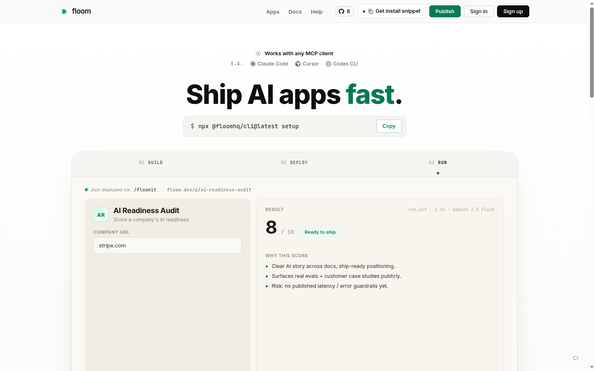
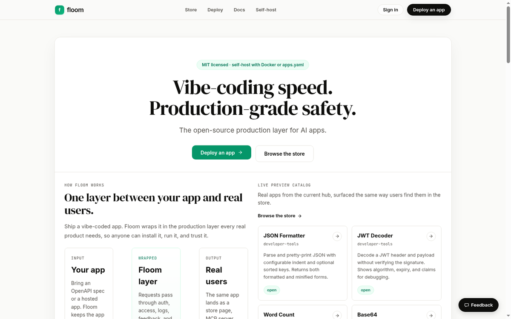
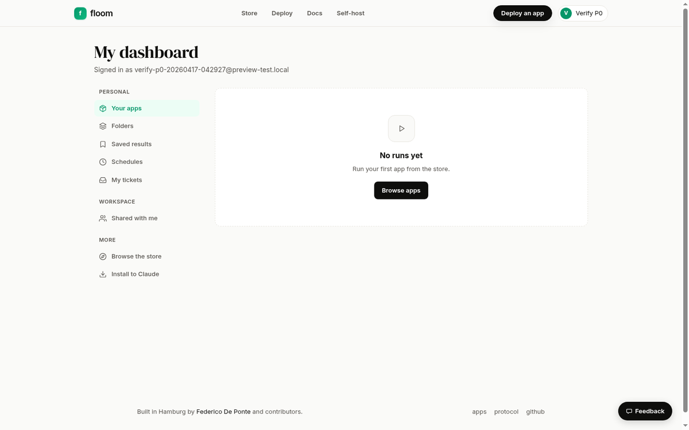

<div align="center">
  

  <h1>Floom</h1>

  <p><strong>Infrastructure for agentic work.</strong><br/>
  <em>Vibe-coding speed. Production-grade safety.</em><br/>
  Turn an OpenAPI spec into an MCP server, an HTTP endpoint, and a shareable web form. Auth, rate limits, run history, and shareable URLs built in.</p>

  <p>
    <a href="https://github.com/floomhq/floom/actions/workflows/ci.yml"></a>
    <a href="https://github.com/floomhq/floom/stargazers"></a>
    <a href="https://github.com/floomhq/floom/blob/main/LICENSE"></a>
    <a href="https://github.com/floomhq/floom/pkgs/container/floom-monorepo"></a>
    <a href="https://discord.gg/8fXGXjxcRz"></a>
    <a href="https://floom.dev"></a>
  </p>

  <p>
    <a href="https://floom.dev/build">Try it</a> ·
    <a href="./docs/SELF_HOST.md">Self-host</a> ·
    <a href="./spec/protocol.md">Protocol</a> ·
    <a href="./docs/ROADMAP.md">Roadmap</a> ·
    <a href="https://discord.gg/8fXGXjxcRz">Discord</a>
  </p>
</div>

---

```
OpenAPI spec ──▶ Floom ──▶ 3 surfaces
                           ├─ MCP server    (/mcp/app/:slug)
                           ├─ HTTP endpoint (/api/:slug/run)
                           └─ Web form      (/p/:slug)
```

> **Install the CLI with `curl -fsSL https://floom.dev/install.sh | bash`.** Do NOT run `npm install floom` - the unscoped `floom` npm package is an unrelated third-party streaming tool. Details: [cli/floom/README.md](./cli/floom/README.md).

Point Floom at an OpenAPI spec and you get all three, from the same manifest, with auth, rate limits, secret injection, run history, and shareable output pages. No glue code.

## Quickstart

One container, no setup:

```bash
docker run -p 3000:3000 ghcr.io/floomhq/floom-monorepo:latest
```

Or sign in at [**floom.dev**](https://floom.dev), paste an OpenAPI URL, hit publish. Full self-host walkthrough: [docs/SELF_HOST.md](./docs/SELF_HOST.md).

## What it is

Floom is a runtime and a protocol for agentic apps. You describe an app once with an OpenAPI spec; Floom gives you an MCP server an agent can call, a plain HTTP endpoint, and a web form on a shareable URL — all at the same time, all backed by the same auth and rate-limit layer.

It's open source, and you can self-host the whole stack in one Docker container.

## The three surfaces

**MCP** — any client that speaks Model Context Protocol (Claude Desktop, Claude Code, Cursor, Codex CLI) can call your app as a tool.

```json
{
  "mcpServers": {
    "resend": { "url": "http://localhost:3010/mcp/app/resend" }
  }
}
```

**HTTP** — straight JSON-in, JSON-out. Use it from curl, a backend, a cron job.

```bash
curl -X POST http://localhost:3010/api/resend/send-email \
  -H "Authorization: Bearer $FLOOM_TOKEN" \
  -H "content-type: application/json" \
  -d '{"from":"hi@floom.dev","to":"you@example.com","subject":"hi","text":"first"}'
```

**Web form** — a clean page at `/p/:slug` your teammates can fill in, with typed inputs, a shareable result URL, and a run history.

```
https://floom.dev/p/lead-scorer
```

## Who it's for

- **Makers shipping side projects.** Paste an OpenAPI URL, publish a shareable page, hand your friends an MCP tool.
- **Teams running internal tools.** Wrap a Stripe-style API in a form your ops team can fill in, with runs logged and outputs rendered cleanly.

Two equal ICPs. Two CTAs on the homepage. Two dashboards (`/me` for runners, `/creator` for publishers).

## Showcase apps

Three apps shipped with Floom to show what it can do:

| App | What it does | Live |
|---|---|---|
| [Lead Scorer](./examples/lead-scorer) | Scores a CSV of leads with Gemini, ranks them, explains why. | [floom.dev/p/lead-scorer](https://floom.dev/p/lead-scorer) |
| [Competitor Analyzer](./examples/competitor-analyzer) | Takes a list of competitor URLs, pulls positioning + pricing + weak spots. | [floom.dev/p/competitor-analyzer](https://floom.dev/p/competitor-analyzer) |
| [Resume Screener](./examples/resume-screener) | Scans a batch of resumes against a job description, ranks and flags. | [floom.dev/p/resume-screener](https://floom.dev/p/resume-screener) |

Each one is a real OpenAPI-defined app under [`examples/`](./examples) — fork, rename, tweak the prompt.

<p align="center">
  
  &nbsp;
  
</p>

## Self-host

```yaml
# apps.yaml — one app, wrapped in 10 lines
apps:
  - slug: resend
    type: proxied
    openapi_spec_url: https://raw.githubusercontent.com/resend/resend-openapi/main/resend.yaml
    base_url: https://api.resend.com
    auth: bearer
    secrets: [RESEND_API_KEY]
    display_name: Resend
    description: "Transactional email API."
```

```bash
docker run -d --name floom \
  -p 3000:3000 \
  -v floom_data:/data \
  -v "$(pwd)/apps.yaml:/app/config/apps.yaml:ro" \
  -e FLOOM_APPS_CONFIG=/app/config/apps.yaml \
  -e RESEND_API_KEY=re_... \
  ghcr.io/floomhq/floom-monorepo:latest
```

Open `http://localhost:3000/p/resend`, or point your agent at `http://localhost:3000/mcp/app/resend`.

Two manifest shapes ship out of the box:

```yaml
# Proxied — wrap an existing API
type: proxied
openapi_spec_url: https://api.example.com/openapi.json
base_url: https://api.example.com
auth: bearer
secrets: [EXAMPLE_API_KEY]
```

```yaml
# Hosted — Floom runs your container
type: hosted
runtime: python3.12
openapi_spec: ./openapi.yaml
build: pip install .
run: uvicorn my_app.server:app --port 8000
```

A single request header can only carry one auth token, so pick one per deployment: `FLOOM_AUTH_TOKEN` (operator-wide kill switch) **or** `FLOOM_CLOUD_MODE=true` (real user sign-in + per-user API keys). Full breakdown: [`docker/.env.example`](./docker/.env.example).

Full self-host guide: [docs/SELF_HOST.md](./docs/SELF_HOST.md) · Protocol spec: [spec/protocol.md](./spec/protocol.md) · More examples: [`examples/`](./examples).

## Repo layout

- `apps/web` — floom.dev web surface (React, form + output renderer)
- `apps/server` — backend (Hono + SQLite + Docker runner + MCP)
- `packages/renderer` — `@floom/renderer`, default + custom output/input renderer library
- `spec/protocol.md` — Floom Protocol spec
- `examples/` — example manifests, including the three showcase apps above

## Development

```bash
pnpm install
pnpm dev
```

Web on `:5173`, server on `:3051`, hot reload on both.

## Contributing

Short version: pick an issue labelled `good first issue` or drop a new example app under [`examples/`](./examples). Full guide, including how to add a showcase app: [CONTRIBUTING.md](./CONTRIBUTING.md).

## Community & support

- **Discord** — [discord.gg/8fXGXjxcRz](https://discord.gg/8fXGXjxcRz) for help, ideas, and patch-of-the-day.
- **Docs** — [floom.dev/docs](https://floom.dev/docs)
- **Issues** — [github.com/floomhq/floom/issues](https://github.com/floomhq/floom/issues) for bugs, feature requests, docs gaps.
- **Security** — read [SECURITY.md](./SECURITY.md), email `security@floom.dev`.

## License

Floom is released under the [MIT license](./LICENSE). Use it at work, use it at home, fork it, sell products built on top of it. If you ship something cool, we'd love to see it in the Discord.

---

<p align="center">
  <a href="https://star-history.com/#floomhq/floom&Date"></a>
</p>

<p align="center">Built in SF by <a href="https://github.com/federicodeponte">@federicodeponte</a>.</p>
