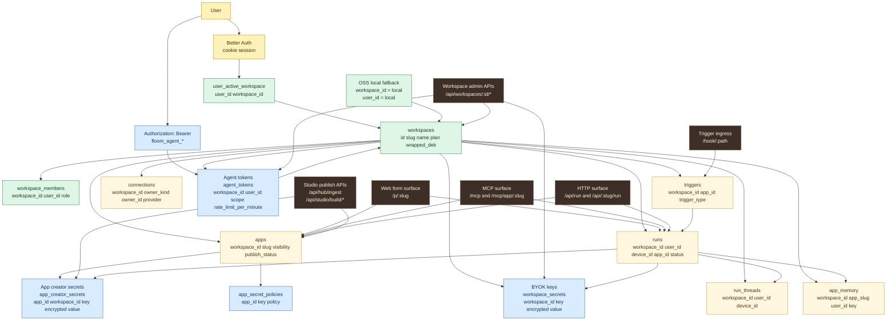
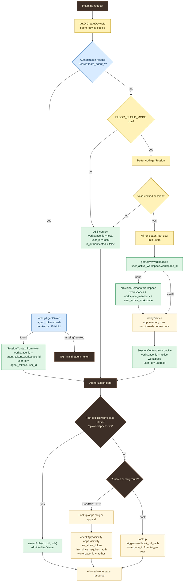
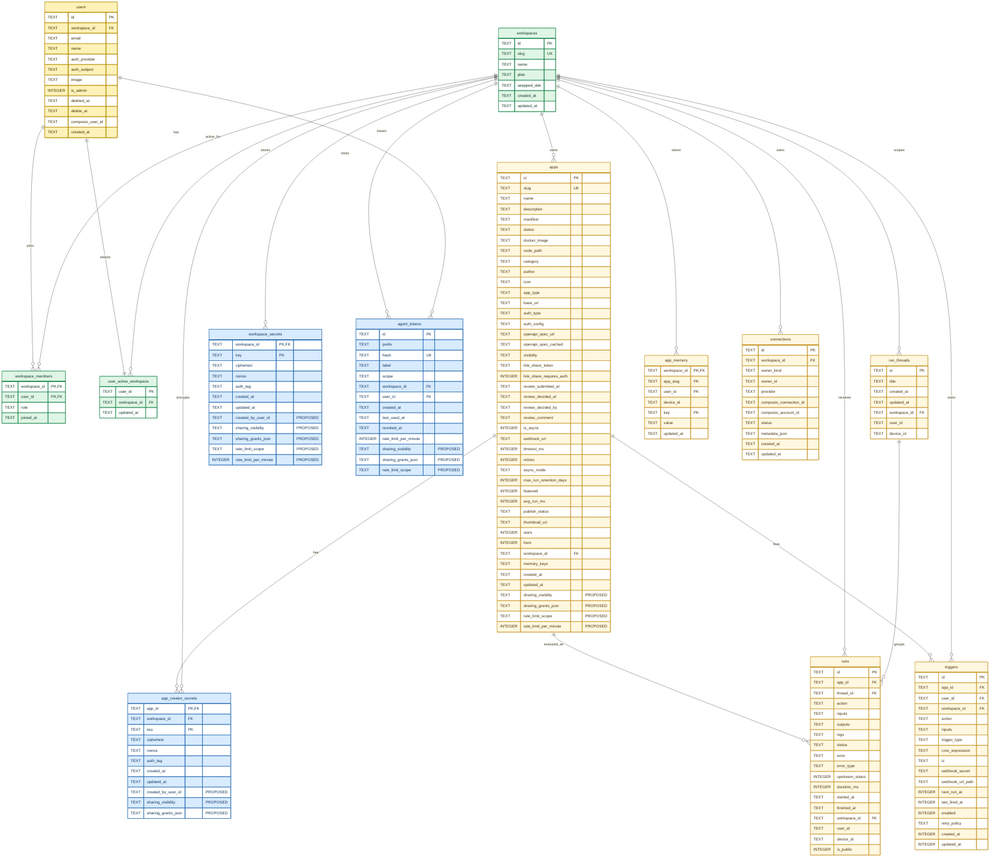
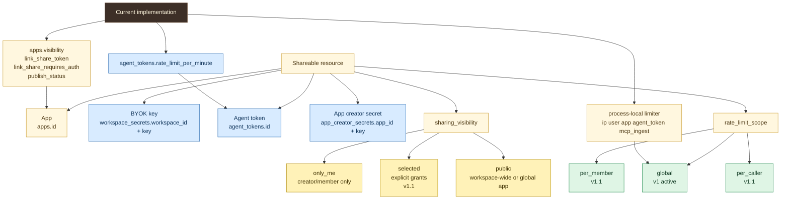
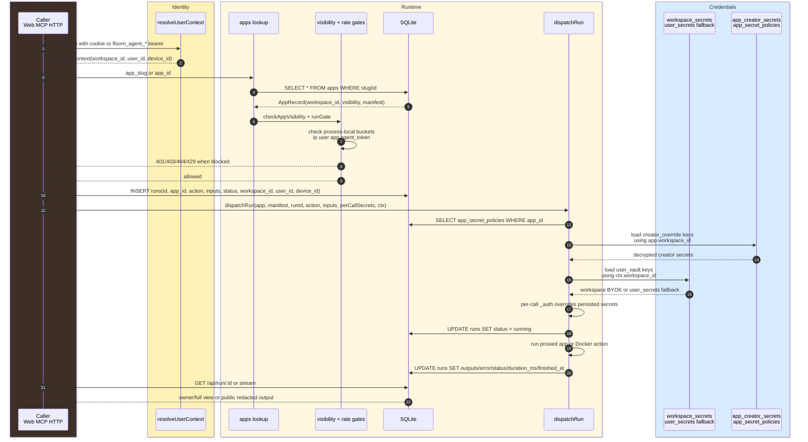
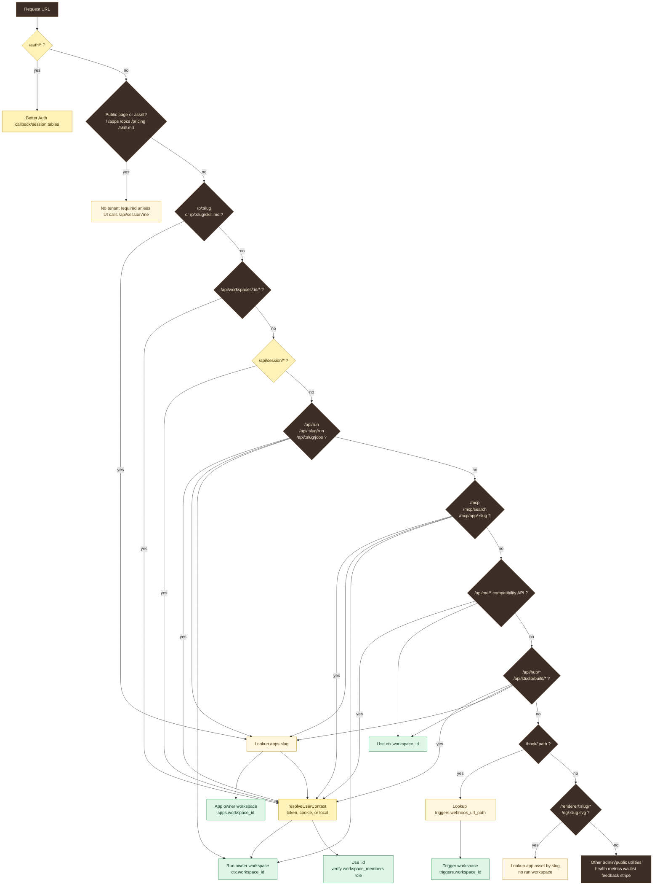

# Floom Architecture

Date: 2026-04-27

Sources verified:

- `docs/FLOOM-ARCHITECTURE-DECISIONS.md`
- `docs/V26-IA-SPEC.md`
- `docs/ARCHITECTURE-WORKSPACE.md`
- `docs/ARCHITECTURE-LAYER-2.md`
- `apps/server/src/db.ts`
- `apps/server/src/types.ts`
- `apps/server/src/routes/*`
- `apps/server/src/services/*`

Legend used in flowchart diagrams:

- Tenant: green
- Identity: yellow
- Credential: blue
- Runtime/data: cream
- Surface/entrypoint: warm dark

Sequence diagrams use Mermaid `box` groups with the same palette because Mermaid sequence syntax does not support `classDef`.

## 1. Top-Level Architecture

Notes:

- Workspace is the tenant boundary.
- v1 exposes one workspace per user in the UI. `workspace_members` and `user_active_workspace` already exist for v1.1.
- Runtime surfaces stay flat: `/p/:slug`, `/mcp/app/:slug`, and `/api/:slug/run` resolve global app slugs, then write runs into the caller workspace.
- Credential families are separate: BYOK keys are workspace runtime credentials, Agent tokens are workspace headless credentials, App creator secrets are publisher-controlled app credentials.

## 2. Authentication And Authorization Flow

Rules verified in code:

- Agent bearer wins when present because `resolveUserContext` checks `getAgentTokenContext(c)` before Better Auth cookies.
- Agent tokens resolve directly to `agent_tokens.workspace_id`; MCP tools do not accept a trusted workspace selector.
- Browser sessions use Better Auth, then `user_active_workspace.workspace_id`; first authenticated request provisions a personal workspace when none exists.
- OSS mode returns `workspace_id = 'local'` and `user_id = 'local'`.
- `/api/workspaces/:id/*` verifies membership or role against `workspace_members`.
- Runtime calls infer workspace from the resolved context. Request bodies cannot change tenant context for `/api/run` or `/api/:slug/run`.

## 3. Database ER

### Schema Notes

Fields that exist today:

- Tenant and membership: `workspaces.id`, `workspaces.slug`, `workspaces.name`, `workspaces.plan`, `workspaces.wrapped_dek`, `workspace_members.workspace_id`, `workspace_members.user_id`, `workspace_members.role`, `user_active_workspace.user_id`, `user_active_workspace.workspace_id`.
- Identity: `users.id`, `users.email`, `users.name`, `users.auth_provider`, `users.auth_subject`, `users.image`, `users.is_admin`, `users.deleted_at`, `users.delete_at`, `users.composio_user_id`.
- Apps: `apps.workspace_id`, `apps.slug`, `apps.visibility`, `apps.link_share_token`, `apps.link_share_requires_auth`, `apps.publish_status`, `apps.author`, `apps.manifest`, `apps.memory_keys`, `apps.max_run_retention_days`.
- BYOK keys: `workspace_secrets.workspace_id`, `workspace_secrets.key`, `workspace_secrets.ciphertext`, `workspace_secrets.nonce`, `workspace_secrets.auth_tag`.
- Legacy per-user BYOK fallback: `user_secrets.workspace_id`, `user_secrets.user_id`, `user_secrets.key`, `user_secrets.ciphertext`, `user_secrets.nonce`, `user_secrets.auth_tag`.
- Agent tokens: `agent_tokens.workspace_id`, `agent_tokens.user_id`, `agent_tokens.scope`, `agent_tokens.rate_limit_per_minute`, `agent_tokens.revoked_at`, `agent_tokens.last_used_at`, `agent_tokens.hash`.
- App creator secrets: `app_creator_secrets.app_id`, `app_creator_secrets.workspace_id`, `app_creator_secrets.key`, encrypted value columns, plus `app_secret_policies.app_id`, `app_secret_policies.key`, `app_secret_policies.policy`.
- Runs and runtime state: `runs.workspace_id`, `runs.user_id`, `runs.device_id`, `runs.is_public`, `run_threads.workspace_id`, `run_threads.user_id`, `run_threads.device_id`, `app_memory.workspace_id`, `triggers.workspace_id`, `connections.workspace_id`.

Fields to add for the locked visibility and rate-limit model:

- Add `sharing_visibility` to `apps`, `workspace_secrets`, `agent_tokens`, and any future shareable resource. Allowed values: `only_me`, `selected`, `public`.
- Add `sharing_grants_json` for the v1.1 selected state, or replace it with a normalized grants table before multi-member UI ships. The grants payload represents workspace members or external users explicitly selected for access.
- Add `created_by_user_id` to `workspace_secrets` and `app_creator_secrets` so "only me" can be enforced without relying on `workspace_id` alone.
- Add `rate_limit_scope` to `apps`, `workspace_secrets`, and `agent_tokens`. Allowed values: `global`, `per_member`, `per_caller`.
- Reuse existing `agent_tokens.rate_limit_per_minute` for Agent tokens. Add `rate_limit_per_minute` to apps and BYOK resources for the v26 resource pattern.

Migration path:

1. Keep current app sharing fields in place: `apps.visibility`, `apps.link_share_token`, `apps.link_share_requires_auth`, and the current invite/review fields keep public app behavior stable.
2. Add nullable proposed columns in an additive migration. Backfill apps from current state: `private` maps to `only_me`; `link`, `public`, `public_live`, and legacy `public` map to `public`; `invited` maps to `selected`.
3. Backfill Agent tokens with `sharing_visibility = 'only_me'` for v1, `rate_limit_scope = 'global'`, and `rate_limit_per_minute = agent_tokens.rate_limit_per_minute`.
4. Backfill workspace BYOK rows with `sharing_visibility = 'public'` in v1 because current `workspace_secrets` are workspace-level and have no creator column. New rows can set `created_by_user_id`.
5. Keep `user_secrets` as the legacy private fallback until all BYOK keys have an owner and sharing state. Then remove the fallback only after a migration report shows no unresolved `workspace_secret_backfill_conflicts`.
6. v1 ships `only_me` plus `public` and `global` rate limits. v1.1 turns on `selected`, `per_member`, and `per_caller` after members and selected-grants UI ship.

## 4. Visibility And Rate-Limit Model

v1 contract:

- Visibility levels exposed: `only_me` and `public`.
- Rate-limit mode exposed: `global`.
- Existing app sharing continues through `apps.visibility`, `link_share_token`, and `link_share_requires_auth`.
- Agent tokens already have per-token throttling through `agent_tokens.rate_limit_per_minute` and the `agent_token` process-local bucket.

v1.1 contract:

- Visibility level added: `selected`, backed by explicit selected users or members.
- Rate-limit modes added: `per_member` and `per_caller`.
- Workspace switcher and members UI make selected access meaningful.
- Optional app-scoped Agent token bindings can land as a separate extension.

## 5. Run Lifecycle

Facts verified in code:

- `/api/run` and `/api/:slug/run` insert `workspace_id`, `user_id`, and `device_id` into `runs`.
- `dispatchRun` loads creator override secrets from the app owner workspace, then user-vault secrets from the caller workspace, then applies per-call `_auth`.
- `runs.is_public` only affects redacted output sharing for a run. It does not expose inputs, logs, or upstream diagnostics.
- MCP root read tools and `/api/agents/run` share `agent_read_tools.runApp`; per-app MCP also inserts scoped runs in `routes/mcp.ts`.

## 6. URL To Resource Resolution

Resolution rules:

- Browser IA uses `/run/*`, `/studio/*`, `/settings/*`, and `/account/settings`. Older `/me/*` browser paths remain redirects or compatibility aliases.
- Runtime APIs keep flat slugs: `/p/:slug`, `/mcp/app/:slug`, `/api/:slug/run`.
- Flat app slug lookup uses `apps.slug`, which is globally unique today.
- Runs are inserted into the caller workspace, not the app owner workspace.
- BYOK keys load from the caller workspace. App creator secrets load from `apps.workspace_id`.
- Webhooks and callbacks use stable flat URLs, then resolve workspace from the target row (`triggers.workspace_id`, build rows, Stripe rows).

## Route Surface Snapshot

Primary mounted route families verified in `apps/server/src/index.ts`:

- Public/utility: `/api/health`, `/api/gh-stars`, `/api/metrics`, `/api/waitlist`, `/api/deploy-waitlist`, `/skill.md`, `/p/:slug/skill.md`, `/openapi.json`.
- App store and Studio: `/api/hub`, `/api/hub/ingest`, `/api/hub/:slug`, `/api/hub/:slug/runs`, `/api/hub/:slug/triggers`, `/api/studio/build/*`.
- Runtime: `/api/run`, `/api/:slug/run`, `/api/:slug/jobs`, `/api/:slug/quota`, `/api/agents/*`, `/mcp`, `/mcp/search`, `/mcp/app/:slug`.
- Workspace admin: `/api/workspaces`, `/api/workspaces/:id`, `/api/workspaces/:id/secrets`, `/api/workspaces/:id/agent-tokens`, `/api/workspaces/:id/members`, `/api/workspaces/:id/invites`.
- Compatibility workspace APIs: `/api/me/runs`, `/api/me/agent-keys`, `/api/secrets`, `/api/memory/:app_slug`, `/api/me/apps/:slug/*`, `/api/me/triggers`.
- External callbacks: `/hook/:path`, `/api/studio/build/github-webhook`, `/api/stripe/webhook`.

## ADR Coverage Checklist

- ADR-001 creator analytics: run data remains private by default; public run sharing is opt-in through `runs.is_public`.
- ADR-002 source visibility: app visibility and source visibility are separate axes; current schema has app sharing fields, source-specific UI remains separate from runtime auth.
- ADR-003 workspaces and roles: `workspace_members.role` keeps `admin`, `editor`, and `viewer`.
- ADR-008 app sharing: current app states are modeled in `apps.visibility` plus review and link fields; v1.1 selected sharing extends the same resource pattern.
- ADR-009 agents-native: Agent tokens are workspace credentials used by MCP, HTTP, CLI, and agent APIs.
- ADR-014 abuse posture: process-local rate limits cover IP, user, app, Agent token, write routes, and MCP ingest.
- ADR-017 Shadcn: UI-only, no backend schema impact.
- V26 point 11: resource sharing and rate limits are represented as a mandatory pattern across apps, BYOK keys, and Agent tokens.

## Self-Review

Flaws found during review:

- The initial ER shape risked hiding existing app sharing fields behind proposed names. This version lists `apps.visibility`, `link_share_token`, `link_share_requires_auth`, and `publish_status` explicitly, then marks proposed additions with `PROPOSED`.
- `workspace_secrets` cannot currently enforce "only me" because the table has no `created_by_user_id` and its primary key is `(workspace_id, key)`. The migration notes call this out and keep `user_secrets` as the private fallback until ownership is migrated.
- Mermaid sequence diagrams do not parse `classDef`. The run lifecycle uses `box rgb(...)` grouping with the same palette and documents that syntax limit.
- `run_threads` is present in the schema with workspace columns, but `routes/thread.ts` has an audit note in Layer 2 that its route handlers are still being tightened. The ER reflects schema state, not a claim that every thread route path is already fully scoped.
- The proposed visibility/rate-limit fields are not in `src/db.ts` today. They are deliberately marked `PROPOSED` and isolated in the schema notes and ER.

Verification performed:

- Source files and architecture docs listed at the top were read before writing.
- Route families were checked against `apps/server/src/index.ts` and `apps/server/src/routes/*`.
- Schema field names were checked against `apps/server/src/db.ts` and `apps/server/src/types.ts`.
- Mermaid parsing was run against every Mermaid block in this document with Mermaid 11.14.0.
