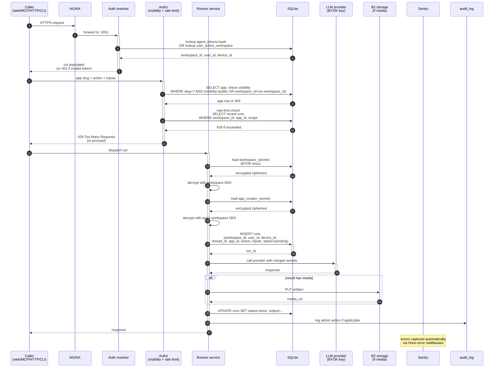
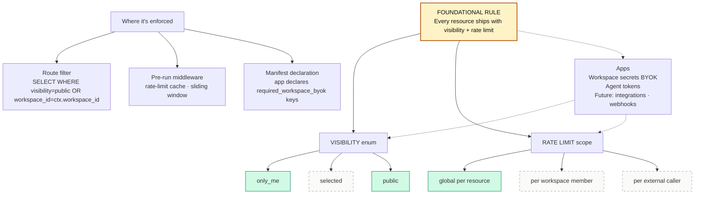

# Floom architecture — comprehensive (claude version)

Date: 2026-04-27
Author: Claude
Scope: Full stack across 13 layers. UI/MCP/CLI/API is just the surface (one layer). Backend, data, storage, infra, observability, analytics included.

Source: /root/floom/docs/FLOOM-ARCHITECTURE-DECISIONS.md (21 ADRs) + /root/floom/apps/server/src/db.ts + /root/floom/docker/docker-compose.yml + V26-IA-SPEC.md

---

## A. Full stack — top-to-bottom (13 layers)

```mermaid
graph TB
  classDef surface fill:#1b1a17,stroke:#0e0e0c,color:#e8e6e0,stroke-width:1.5px
  classDef edge fill:#fef3c7,stroke:#b45309,color:#0e0e0c
  classDef auth fill:#dbeafe,stroke:#1d4ed8,color:#0e0e0c
  classDef app fill:#d1fae5,stroke:#047857,color:#0e0e0c
  classDef authz fill:#fef3c7,stroke:#b45309,color:#0e0e0c
  classDef data fill:#fafaf8,stroke:#0e0e0c,color:#0e0e0c,stroke-width:1.5px
  classDef storage fill:#e0e7ff,stroke:#4338ca,color:#0e0e0c
  classDef external fill:#f5f4f0,stroke:#666,stroke-dasharray: 5 5,color:#666
  classDef runtime fill:#fce7f3,stroke:#9d174d,color:#0e0e0c
  classDef obs fill:#ede9fe,stroke:#6d28d9,color:#0e0e0c
  classDef infra fill:#f3f4f6,stroke:#374151,color:#0e0e0c
  classDef analytics fill:#fff7ed,stroke:#c2410c,color:#0e0e0c
  classDef ui fill:#d1fae5,stroke:#047857,color:#0e0e0c

  subgraph L1[1 · Surface / Edge]
    direction LR
    Web[Web<br/>browser]:::surface
    MCP[MCP<br/>Claude · Cursor · Codex]:::surface
    HTTP[HTTP API<br/>curl · scripts]:::surface
    CLI[floom CLI]:::surface
    Mobile[Mobile / PWA]:::surface
  end

  subgraph L2[2 · Edge / Transport]
    NGINX[nginx reverse proxy<br/>:80 :443 → :3051]:::edge
    TLS[TLS termination]:::edge
    CORS[CORS headers]:::edge
    EdgeRL[IP rate limit<br/>waitlist endpoint]:::edge
    CSRF[CSRF protection]:::edge
  end

  subgraph L3[3 · Auth]
    BetterAuth[Better Auth<br/>cookie sessions]:::auth
    GoogleOAuth[Google OAuth]:::auth
    GitHubOAuth[GitHub OAuth<br/>v1.1 if configured]:::auth
    AgentToken[Agent tokens<br/>floom_agent_*<br/>workspace-bound]:::auth
    OSSLocal[OSS local fallback<br/>workspace_id=local]:::auth
    Resolver[Workspace resolver<br/>SessionContext]:::auth
  end

  subgraph L4[4 · Application Layer · Hono]
    Routes[Routes<br/>/api/hub · /api/run · /api/workspaces<br/>/mcp · /auth · /hook · /renderer · /og]:::app
    Services[Services<br/>workspaces · runner · user_secrets<br/>agent_tokens · hub_apps · builds<br/>triggers · webhook · sharing<br/>app_memory · cleanup · openapi-ingest]:::app
  end

  subgraph L5[5 · Authorization]
    Roles[Role-based access<br/>admin · editor · viewer]:::authz
    Visibility[Resource visibility<br/>only_me · selected · public<br/>FOUNDATIONAL RULE]:::authz
    RateLimit[Rate-limit enforcement<br/>per member · per caller · global<br/>FOUNDATIONAL RULE]:::authz
    Scopes[Token scope<br/>read · read-write · publish-only]:::authz
  end

  subgraph L6[6 · Data Layer]
    SQLite[SQLite<br/>better-sqlite3<br/>/data/floom.db]:::data
    Encryption[Per-row encryption<br/>workspace DEK + KEK<br/>libsodium-wrap]:::data
    Tables[~20 tables<br/>workspaces · users · apps<br/>workspace_secrets · agent_tokens<br/>runs · run_threads · app_memory<br/>triggers · builds · connections<br/>app_reviews · feedback · waitlist · audit_log]:::data
    Indices[Indices<br/>workspaces.slug · users.email<br/>apps.slug · agent_tokens.hash]:::data
    FKs[Foreign keys<br/>+ ON DELETE CASCADE]:::data
  end

  subgraph L7[7 · Storage]
    DataVol[/data SQLite primary]:::storage
    B2[B2 / Backblaze<br/>media · uploads · build artifacts]:::storage
    FileInputs[/opt/floom-launch-file-inputs<br/>runtime file inputs]:::storage
    Ephemeral[Container ephemeral<br/>build during ingest]:::storage
  end

  subgraph L8[8 · External Services]
    Resend[Resend<br/>signup · reset · invite emails]:::external
    GoogleSvc[Google OAuth API]:::external
    GitHubApp[GitHub App<br/>build-from-github]:::external
    StripeAcc[Stripe Connect<br/>creator payments v1.1]:::external
    Sentry[Sentry<br/>error tracking]:::external
    Discord[Discord webhook<br/>admin notifications]:::external
    LLMs[Anthropic · OpenAI · Gemini<br/>BYOK runtime callers]:::external
  end

  subgraph L9[9 · Runtime / Execution]
    Hono[Hono framework<br/>Bun + Node 20]:::runtime
    Adapters[Per-app adapters<br/>openapi · docker · floom-native]:::runtime
    Dispatcher[Run dispatcher<br/>sync · async]:::runtime
    JobQueue[Job queue<br/>v1.1 for async runs]:::runtime
    SchedTrig[Schedule trigger<br/>cron loop]:::runtime
    WebhookIn[Webhook receiver<br/>HMAC verify]:::runtime
    Builders[Build runners<br/>clone · detect · dockerize · push]:::runtime
  end

  subgraph L10[10 · Observability]
    SentryObs[Sentry error capture]:::obs
    AuditLog[audit_log table<br/>admin actions]:::obs
    RetentionSweep[Run retention sweeper<br/>background]:::obs
    CleanupJob[Cleanup job<br/>orphaned data]:::obs
    Metrics[/api/metrics<br/>Prometheus]:::obs
    StdoutLogs[stdout → docker → journald]:::obs
  end

  subgraph L11[11 · Infrastructure]
    AX41[AX41 Hetzner<br/>dev + preview runtime]:::infra
    HetznerSmall[Hetzner VPS small<br/>prod cutover]:::infra
    NginxInfra[nginx]:::infra
    DockerEng[Docker Engine]:::infra
    Containers[Containers<br/>floom-preview-launch · floom-mcp-preview<br/>floom-l7-* per-app sandboxes]:::infra
    GHCR[ghcr.io/floomhq/floom-monorepo<br/>image registry]:::infra
  end

  subgraph L12[12 · Analytics / Telemetry]
    RunTel[Run telemetry<br/>workspace_id · user_id · device_id<br/>app_id · status · latency · model · tokens]:::analytics
    Reviews[App reviews<br/>1 per workspace,app,user]:::analytics
    Feedback[Feedback<br/>admin-readable]:::analytics
    Waitlist[Waitlist signups<br/>per-IP rate-limited]:::analytics
    AppMem[app_memory<br/>per-(ws,app,user) JSON]:::analytics
    PublicMetrics[Public app metrics<br/>aggregated by slug · surface · day]:::analytics
  end

  subgraph L13[13 · UI Mode · post-v26]
    WorkspaceShell[WorkspaceShell<br/>single component<br/>mode-aware: run · studio]:::ui
    SettingsTabbed[Settings tabbed page<br/>General · BYOK · Agent · Studio]:::ui
    AccountPage[Account settings]:::ui
    PublicPages[Public pages<br/>/ · /apps · /p/:slug · /login]:::ui
  end

  %% Vertical traversal
  L1 ==> L2
  L2 ==> L3
  L3 ==> L4
  L4 ==> L5
  L5 ==> L6
  L6 -.-> L7
  L4 -.-> L8
  L4 -.-> L9
  L9 -.-> L6
  L4 -.-> L10
  L6 -.-> L10
  L11 -.-> L1
  L11 -.-> L6
  L11 -.-> L7
  L4 -.-> L12
  L13 -.-> L1
```

### How to read

- Layers 1-13 stacked top-to-bottom
- Solid arrows = primary request flow (surface → edge → auth → app → authz → data → storage)
- Dashed arrows = side-effects (telemetry, observability, external service calls)

---

## B. Request flow — sequence diagram for a single run



---

## C. Database — comprehensive ER

```mermaid
erDiagram
  WORKSPACES ||--o{ WORKSPACE_MEMBERS : "members of"
  WORKSPACES ||--o{ APPS : "owns"
  WORKSPACES ||--o{ WORKSPACE_SECRETS : "owns BYOK"
  WORKSPACES ||--o{ AGENT_TOKENS : "owns"
  WORKSPACES ||--o{ RUNS : "owns"
  WORKSPACES ||--o{ RUN_THREADS : "owns"
  WORKSPACES ||--o{ APP_MEMORY : "scopes"
  WORKSPACES ||--o{ TRIGGERS : "owns"
  WORKSPACES ||--o{ CONNECTIONS : "owns OAuth links"
  WORKSPACES ||--o{ STRIPE_ACCOUNTS : "linked"
  WORKSPACES ||--o{ APP_INVITES : "issues"
  WORKSPACES ||--o{ WORKSPACE_INVITES : "issues"

  USERS ||--o{ WORKSPACE_MEMBERS : "joined"
  USERS ||--o| USER_ACTIVE_WORKSPACE : "selects"
  USERS ||--o{ AGENT_TOKENS : "minted (audit only)"
  USERS ||--o{ RUNS : "ran by"
  USERS ||--o{ APP_REVIEWS : "wrote"
  USERS ||--o{ FEEDBACK : "submitted"

  APPS ||--o{ APP_CREATOR_SECRETS : "ships"
  APPS ||--o{ TRIGGERS : "fires"
  APPS ||--o{ RUNS : "executed"
  APPS ||--o{ APP_MEMORY : "stores"
  APPS ||--o{ APP_REVIEWS : "rated by"
  APPS ||--o{ BUILDS : "built from"

  RUN_THREADS ||--o{ RUNS : "groups"

  WORKSPACES {
    text id PK
    text slug UK
    text name
    text plan
    text wrapped_dek "encrypted DEK"
    timestamp created_at
    timestamp updated_at
  }

  USERS {
    text id PK
    text email
    text name
    text image
    text auth_provider "google · github · local"
    text auth_subject
    text workspace_id FK "creator's default ws"
    timestamp created_at
  }

  WORKSPACE_MEMBERS {
    text workspace_id PK_FK
    text user_id PK_FK
    text role "admin · editor · viewer"
    timestamp joined_at
  }

  USER_ACTIVE_WORKSPACE {
    text user_id PK
    text workspace_id FK
    timestamp updated_at
  }

  APPS {
    text id PK
    text slug UK
    text workspace_id FK
    text manifest "JSON"
    text app_type "openapi · docker · floom-native"
    bool is_async
    text visibility "v26 · only_me · selected · public"
    bool source_visible
    int rate_limit_global "v26"
    int rate_limit_per_member "v1.1"
    int rate_limit_per_caller "v1.1"
    timestamp created_at
  }

  WORKSPACE_SECRETS {
    text workspace_id PK_FK
    text key PK
    text ciphertext "encrypted with workspace DEK"
    text nonce
    text auth_tag
    text visibility "v26"
    timestamp created_at
    timestamp updated_at
  }

  USER_SECRETS_LEGACY {
    text workspace_id FK
    text user_id PK_FK
    text key PK
    text ciphertext "legacy · dual-read fallback"
    text nonce
    text auth_tag
  }

  AGENT_TOKENS {
    text id PK
    text prefix
    text hash UK
    text label
    text scope "read · read-write · publish-only"
    text workspace_id FK
    text issued_by_user_id FK "audit only"
    text visibility "v26"
    int rate_limit_per_minute
    timestamp last_used_at
    timestamp revoked_at
    timestamp created_at
  }

  APP_CREATOR_SECRETS {
    text app_id PK_FK
    text key PK
    text ciphertext
    text nonce
    text auth_tag
  }

  RUNS {
    text id PK
    text workspace_id FK
    text user_id FK
    text device_id
    text thread_id FK
    text app_id FK
    text action
    text inputs "JSON"
    text output "JSON"
    text status "pending · running · done · failed"
    int duration_ms
    text model
    int tokens_in
    int tokens_out
    timestamp created_at
  }

  RUN_THREADS {
    text id PK
    text workspace_id FK
    text user_id FK
    timestamp created_at
  }

  APP_MEMORY {
    text workspace_id PK_FK
    text app_slug PK
    text user_id PK
    text device_id
    text key PK
    text value_json
    timestamp updated_at
  }

  TRIGGERS {
    text id PK
    text app_id FK
    text workspace_id FK
    text type "schedule · webhook"
    text cron
    text webhook_url_path
    text payload_template "JSON"
    timestamp created_at
  }

  BUILDS {
    text id PK
    text workspace_id FK
    text app_id FK
    text source_url "github · openapi"
    text status
    timestamp started_at
    timestamp completed_at
  }

  CONNECTIONS {
    text id PK
    text workspace_id FK
    text provider "github · ..."
    text status "active · revoked"
    text encrypted_token
  }

  STRIPE_ACCOUNTS {
    text workspace_id PK_FK
    text stripe_account_id
    text status
  }

  APP_REVIEWS {
    text id PK
    text workspace_id FK
    text app_slug FK
    text user_id FK
    int rating "1-5"
    text body
    timestamp created_at
  }

  APP_INVITES {
    text id PK
    text workspace_id FK
    text app_slug FK
    text invitee_email
    text token UK
    text status
  }

  WORKSPACE_INVITES {
    text id PK
    text workspace_id FK
    text invitee_email
    text token UK
    text role "admin · editor · viewer"
    text status
    timestamp expires_at
  }

  FEEDBACK {
    text id PK
    text user_id FK
    text source
    text body
    timestamp created_at
  }

  WAITLIST_SIGNUPS {
    text id PK
    text email
    text ip_hash "sha256 of IP + secret"
    timestamp created_at
  }

  AUDIT_LOG {
    text id PK
    text workspace_id FK
    text user_id FK
    text action
    text resource_type
    text resource_id
    text payload "JSON"
    timestamp created_at
  }
```

---

## D. Visibility + rate-limit (foundational rule, refined)



---

## E. Deployment topology

```mermaid
graph TB
  classDef host fill:#f3f4f6,stroke:#374151
  classDef container fill:#dbeafe,stroke:#1d4ed8
  classDef vol fill:#fef3c7,stroke:#b45309
  classDef external fill:#fafaf8,stroke:#999,stroke-dasharray: 5 5

  subgraph AX41[AX41 Hetzner · 65.21.90.216]
    NginxAX[nginx :80 :443]:::host
    DockerEng[Docker Engine]:::host

    subgraph DC[Docker containers]
      FloomPreview[floom-preview-launch<br/>image: floom-preview-local:auto-*]:::container
      FloomMCP[floom-mcp-preview<br/>:3051 → :3000]:::container
      L7Apps[floom-l7-*<br/>per-app sandboxes]:::container
      Postgres[floom-storage-contract-postgres<br/>:55432<br/>storage contract testing only]:::container
    end

    subgraph Vols[Volumes]
      DataVol[/data<br/>SQLite floom.db]:::vol
      FileInputs[/opt/floom-launch-file-inputs]:::vol
    end

    NginxAX --> FloomPreview
    NginxAX --> FloomMCP
    DockerEng --> DC
    FloomPreview -.reads.- DataVol
    FloomPreview -.reads.- FileInputs
  end

  subgraph HetznerSmall[Hetzner VPS small · prod]
    ProdContainer[floom prod container<br/>Tuesday cutover target]:::container
    ProdData[/data prod SQLite]:::vol
    ProdContainer -.- ProdData
  end

  subgraph External
    GHCR[ghcr.io/floomhq/floom-monorepo:latest<br/>image registry]:::external
    B2Backblaze[B2 Backblaze<br/>media · uploads]:::external
    ResendSvc[Resend API<br/>noreply@send.floom.dev]:::external
    GoogleSvc[Google OAuth<br/>1040922256467-...apps.googleusercontent.com]:::external
    SentrySvc[Sentry]:::external
    DiscordSvc[Discord webhook]:::external
  end

  AX41 -.pull.- GHCR
  AX41 -.media.- B2Backblaze
  AX41 -.email.- ResendSvc
  AX41 -.auth.- GoogleSvc
  AX41 -.errors.- SentrySvc
  AX41 -.notify.- DiscordSvc
  HetznerSmall -.pull.- GHCR
  HetznerSmall -.media.- B2Backblaze
```

---

## F. Analytics / telemetry pipeline

```mermaid
graph LR
  classDef source fill:#1b1a17,stroke:#0e0e0c,color:#e8e6e0
  classDef table fill:#fafaf8,stroke:#0e0e0c
  classDef agg fill:#d1fae5,stroke:#047857
  classDef report fill:#dbeafe,stroke:#1d4ed8

  RunEvent[Run event<br/>workspace · user · device · app · action]:::source
  ReviewEvent[App review<br/>workspace · user · app · rating]:::source
  FeedbackEvent[Feedback<br/>user · source · body]:::source
  WaitlistEvent[Waitlist signup<br/>email · IP hash]:::source
  AuditEvent[Admin action<br/>workspace · user · resource]:::source
  AppMemEvent[App memory write<br/>workspace · app · user · key · value]:::source

  RunEvent --> Runs[runs table]:::table
  ReviewEvent --> Reviews[app_reviews table]:::table
  FeedbackEvent --> FB[feedback table]:::table
  WaitlistEvent --> WL[waitlist_signups table]:::table
  AuditEvent --> AL[audit_log table]:::table
  AppMemEvent --> AM[app_memory table]:::table

  Runs --> AggDay[Aggregations<br/>per workspace · per app · per day]:::agg
  Runs --> AggSurface[Aggregations<br/>per surface · per app]:::agg
  Reviews --> AggApp[Per-app rating average]:::agg

  AggDay --> StudioMetric[Studio dashboard hero metric<br/>Runs across all your apps · last 7d]:::report
  AggSurface --> StoreMetric[App store: surface mix<br/>web · MCP · HTTP]:::report
  AggApp --> StoreReview[App store: review stars]:::report
  Runs --> RunHistory[/run/runs page]:::report
  AL --> AdminPanel[Admin audit trail]:::report
```

---

## G. External service map

```mermaid
graph LR
  classDef external fill:#fafaf8,stroke:#999,stroke-dasharray: 5 5
  classDef envvar fill:#fef3c7,stroke:#b45309
  classDef floom fill:#d1fae5,stroke:#047857

  subgraph FloomServer[Floom server]
    Server[apps/server<br/>Hono]:::floom
  end

  subgraph Resend
    ResendAPI[Resend API]:::external
    ResendKey[RESEND_API_KEY<br/>RESEND_FROM]:::envvar
  end

  subgraph Google
    GAuth[Google OAuth]:::external
    GKeys[GOOGLE_OAUTH_CLIENT_ID<br/>GOOGLE_OAUTH_CLIENT_SECRET]:::envvar
  end

  subgraph GitHub
    GHAuth[GitHub OAuth<br/>+ GitHub App]:::external
    GHKeys[GITHUB_OAUTH_CLIENT_ID<br/>GITHUB_OAUTH_CLIENT_SECRET<br/>+ GitHub App private key]:::envvar
  end

  subgraph Storage
    B2API[B2 / Backblaze API]:::external
    B2Keys[B2_BUCKET<br/>B2_KEY_ID · B2_APP_KEY]:::envvar
  end

  subgraph Stripe
    StripeAPI[Stripe Connect]:::external
    StripeKeys[STRIPE_SECRET_KEY<br/>STRIPE_CONNECT_CLIENT_ID]:::envvar
  end

  subgraph Sentry
    SentryAPI[Sentry]:::external
    SentryKeys[SENTRY_DSN]:::envvar
  end

  subgraph Discord
    DiscordAPI[Discord webhook]:::external
    DiscordKeys[DISCORD_WEBHOOK_URL]:::envvar
  end

  subgraph LLMs
    Anth[Anthropic API]:::external
    OAI[OpenAI API]:::external
    Gem[Gemini API]:::external
    BYOKMode[BYOK keys live in workspace_secrets<br/>NOT env vars]:::floom
  end

  Server -.signup/reset/invite.- ResendAPI
  ResendKey -.config.- Server
  Server -.user signin.- GAuth
  GKeys -.config.- Server
  Server -.user signin · build.- GHAuth
  GHKeys -.config.- Server
  Server -.media uploads.- B2API
  B2Keys -.config.- Server
  Server -.creator payments v1.1.- StripeAPI
  StripeKeys -.config.- Server
  Server -.errors.- SentryAPI
  SentryKeys -.config.- Server
  Server -.admin notifications.- DiscordAPI
  DiscordKeys -.config.- Server
  Server -.via runner with workspace BYOK.- Anth
  Server -.via runner with workspace BYOK.- OAI
  Server -.via runner with workspace BYOK.- Gem
  BYOKMode -.fed by workspace_secrets table.- Server
```

---

## H. UI component tree (post-v26)

```mermaid
graph TB
  classDef shell fill:#d1fae5,stroke:#047857
  classDef shared fill:#fef3c7,stroke:#b45309
  classDef page fill:#ffffff,stroke:#0e0e0c
  classDef public fill:#dbeafe,stroke:#1d4ed8
  classDef killed fill:#fafaf8,stroke:#999,stroke-dasharray:5 5,color:#999

  AppRoot[App.tsx]
  AuthGate[AuthGate]:::shell

  subgraph Public[Public surfaces · unauthenticated]
    LandingP[/]:::public
    AppsP[/apps]:::public
    SlugP[/p/:slug + 8 states]:::public
    LoginP[/login]:::public
    SignupP[/signup]:::public
    InstallP[/install · /install-in-claude · /install/:slug]:::public
    IaP[/ia · /architecture]:::public
  end

  subgraph Authed[Authenticated]
    Layout[WorkspaceShell<br/>identity + mode toggle + rail]:::shell
    Layout --> WorkspaceRail[WorkspaceRail<br/>mode prop: run · studio]:::shared
    Layout --> TopBarSlim[TopBar slim<br/>logo · Copy for Claude · + New app · avatar]:::shared

    Layout --> RunApps[/run/apps]:::page
    Layout --> RunRuns[/run/runs]:::page
    Layout --> RunRunsDetail[/run/runs/:id]:::page
    Layout --> RunInstall[/run/install]:::page
    Layout --> RunAppRun[/run/apps/:slug/run]:::page
    Layout --> RunAppTriggers[/run/apps/:slug/triggers/*]:::page

    Layout --> StudioApps[/studio/apps]:::page
    Layout --> StudioRuns[/studio/runs]:::page
    Layout --> StudioBuild[/studio/build]:::page
    Layout --> StudioApp[/studio/apps/:slug]:::page

    Layout --> Settings[/settings · /settings/:tab]:::page
    Layout --> Account[/account/settings]:::page

    StudioApp --> StudioAppTabs[Overview · Runs · App creator secrets · Access · Analytics · Source · Feedback · Triggers]
    StudioAppTabs --> SecretsTab[App creator secrets<br/>+ Workspace BYOK requirements<br/>2-section per Federico's point 8]:::shared

    Settings --> SettingsTabs[General · BYOK keys · Agent tokens · Studio settings]
  end

  AppRoot --> AuthGate
  AuthGate -->|unauth| Public
  AuthGate -->|authed| Layout

  Killed1[RunRail · separate]:::killed
  Killed2[StudioRail · separate]:::killed
  Killed3[SettingsRail · separate]:::killed
  Killed4[/run dashboard MePage]:::killed
  Killed5[/studio dashboard StudioHomePage]:::killed
```

Killed in v26:
- ❌ `RunRail` separate component → folded into `WorkspaceRail` with `mode="run"`
- ❌ `StudioRail` separate component → folded with `mode="studio"`
- ❌ `SettingsRail` separate component → folded
- ❌ `MePage` (/run dashboard) → /run redirects to /run/apps
- ❌ `StudioHomePage` (/studio dashboard) → /studio redirects to /studio/apps

---

## Schema changes needed for v26 (foundational rule)

| Table | New field | Type | Why |
|---|---|---|---|
| `apps` | `visibility` | TEXT enum (only_me/selected/public) | App-level sharing |
| `apps` | `rate_limit_global` | INTEGER | Per-app cap across all callers |
| `apps` | `rate_limit_per_member` | INTEGER | v1.1 per-member cap |
| `apps` | `rate_limit_per_caller` | INTEGER | v1.1 per-token-bearer cap |
| `workspace_secrets` | `visibility` | TEXT enum | Key-level sharing |
| `agent_tokens` | `visibility` | TEXT enum | Token-level sharing (auditability across workspace) |

Migration plan:
- Idempotent ALTER TABLE adds (default `only_me` for keys/tokens, `public` for currently-public apps via /api/hub)
- Backfill: derive visibility from existing `apps.is_public` if any
- v1 enforcement: only `only_me` and `public` enums accepted; `selected` returns 400 in middleware
- v1.1: enable `selected` + per-member/per-caller rate limits

---

## Single source of truth

This diagram is downstream of:
- `/root/floom/docs/FLOOM-ARCHITECTURE-DECISIONS.md` (21 ADRs)
- `/root/floom/docs/V26-IA-SPEC.md` (latest IA spec)
- `/root/floom/apps/server/src/db.ts` (schema truth)
- `/root/floom/docker/.env.example` (env var truth)

If any of those drift, this diagram is wrong. Update together.
