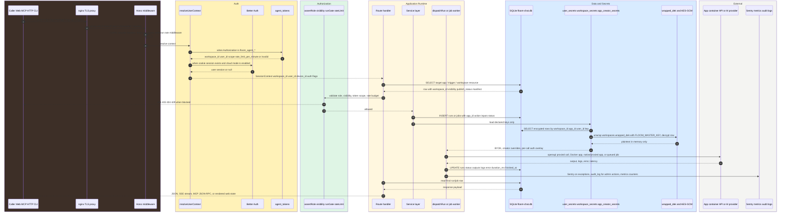
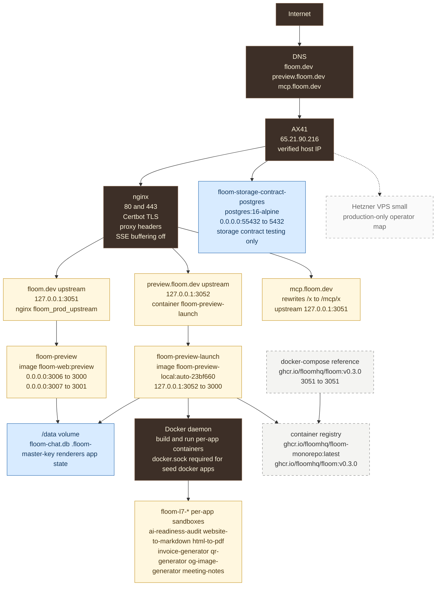
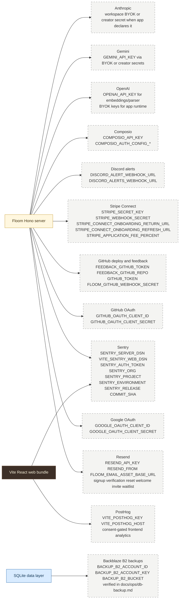
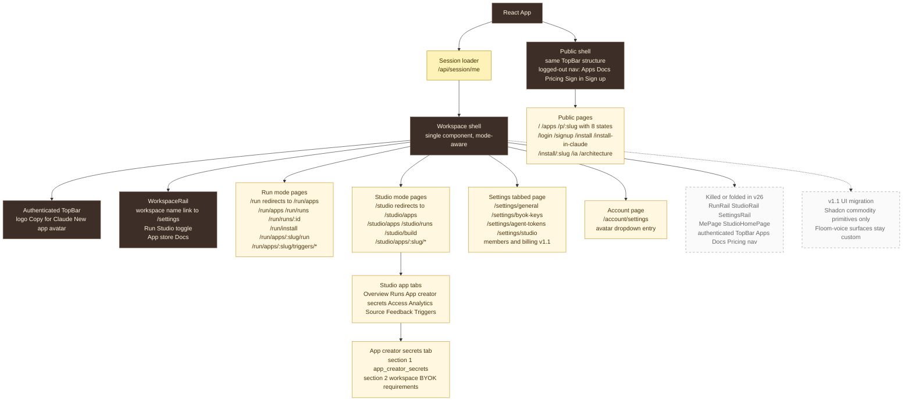

# Floom Architecture - Comprehensive Stack Map

Date: 2026-04-27

Verified sources:

- `docs/FLOOM-ARCHITECTURE-DECISIONS.md`
- `docs/V26-IA-SPEC.md`
- `docs/FLOOM-ARCHITECTURE-DIAGRAM.md`
- `docs/FLOOM-ARCHITECTURE-CODEX.md`
- `apps/server/src/db.ts`
- `apps/server/src/services/*`
- `apps/server/src/routes/*`
- `apps/server/src/lib/auth.ts`, `agent-tokens.ts`, `better-auth.ts`, `rate-limit.ts`, `file-inputs.ts`
- `apps/server/src/services/user_secrets.ts`
- `apps/server/src/index.ts`
- `docker/docker-compose.yml`
- `docker/Dockerfile`
- live nginx config and live Docker container list on AX41

Important verified names:

- SQLite path in code: `DATA_DIR/floom-chat.db`; with Docker defaults this is `/data/floom-chat.db`.
- Encryption KEK env in code: `FLOOM_MASTER_KEY`; no `FLOOM_ENCRYPTION_KEY` reference exists in `apps/server/src`.
- Workspace DEK field: `workspaces.wrapped_dek`.
- Current v1 resource sharing fields exist mainly on `apps` plus Agent-token rate fields. The v26 cross-resource fields are listed as required additions, not present columns.

Color key used across flowchart diagrams:

- Surface and edge: dark brown
- Auth and identity: yellow
- Tenant and authorization: green
- Application and service runtime: cream
- Data and storage: blue
- External services: gray dashed
- v1.1 deferred or proposed: dashed gray

## A. Full Stack Diagram

```mermaid
flowchart TD
  classDef surface fill:#3d2f27,stroke:#7a5b45,color:#fff7df,stroke-width:1px
  classDef auth fill:#fff2b8,stroke:#b38b00,color:#3f3100,stroke-width:1px
  classDef tenant fill:#dff5e5,stroke:#1f8a4c,color:#123b24,stroke-width:1px
  classDef app fill:#fff7df,stroke:#c99a2e,color:#4a3510,stroke-width:1px
  classDef data fill:#d8ebff,stroke:#2f6fb3,color:#12365c,stroke-width:1px
  classDef external fill:#f4f4f2,stroke:#8a8a8a,color:#333,stroke-dasharray:5 5
  classDef deferred fill:#fafafa,stroke:#999,color:#666,stroke-dasharray:5 5

  subgraph L1["1. Surface / Edge Layer"]
    Web["Web browser<br/>/p/:slug /apps /run /studio /settings"]:::surface
    MCP["MCP clients<br/>/mcp /mcp/search /mcp/app/:slug"]:::surface
    HTTP["HTTP callers<br/>/api/run /api/:slug/run /api/:slug/jobs"]:::surface
    CLI["CLI floom command<br/>auth deploy init"]:::surface
    Mobile["Mobile PWA / responsive web<br/>same React SPA"]:::surface
  end

  subgraph L2["2. Edge / Transport"]
    Nginx["nginx reverse proxy<br/>80 to 443 redirect<br/>TLS termination<br/>SSE buffering off for /mcp and /api/run/:id/stream"]:::surface
    Cors["Hono CORS split<br/>restricted cookie routes vs open server-to-server routes"]:::surface
    Headers["securityHeaders middleware<br/>CSP HSTS nosniff referrer policy<br/>preview noindex"]:::surface
    RateMw["rate-limit middleware<br/>run buckets: ip user app agent_token mcp_ingest<br/>write buckets: ip user"]:::surface
    Csrf["Better Auth cookie protection<br/>restricted CORS + same-origin cookies"]:::surface
    WaitIp["waitlist IP limiter<br/>/api/waitlist ip_hash"]:::surface
  end

  subgraph L3["3. Auth Layer"]
    Better["Better Auth<br/>/auth/* cookie sessions<br/>email password OAuth"]:::auth
    OAuth["Google OAuth<br/>GitHub OAuth"]:::external
    Token["Agent tokens<br/>floom_agent_* bearer<br/>agent_tokens.hash"]:::auth
    Local["Anonymous OSS local fallback<br/>workspace_id local<br/>user_id local"]:::auth
    Resolver["resolveUserContext<br/>token wins, else cookie, else local"]:::auth
  end

  subgraph L4["4. Application Layer - Hono Routes And Services"]
    Routes["Routes<br/>/api/hub /api/run /api/me/* /api/workspaces/:id/*<br/>/api/secrets /api/agents/* /mcp/* /auth/*<br/>/hook/* /renderer/* /og/* /api/studio/build/*"]:::app
    Services["Services<br/>workspaces user_secrets app_creator_secrets runner sharing app_memory cleanup<br/>run-retention-sweeper openapi-ingest docker-image-ingest<br/>github-deploy jobs worker triggers webhook"]:::app
    Workers["Background workers<br/>job worker trigger worker GitHub build worker<br/>zombie run sweeper run retention sweeper audit sweeper cleanup"]:::app
  end

  subgraph L5["5. Authorization Layer"]
    Roles["workspace_members.role<br/>admin editor viewer"]:::tenant
    AppVis["App visibility state<br/>private link invited pending_review public_live changes_requested"]:::tenant
    ResourcePattern["v26 resource pattern<br/>only_me selected public<br/>global per_member per_caller"]:::tenant
    TokenScope["Agent token scope<br/>read read-write publish-only"]:::tenant
    Gate["Gates<br/>assertRole checkAppVisibility runGate<br/>session validation agent-token validation"]:::tenant
  end

  subgraph L6["6. Data Layer - SQLite"]
    SQLite["better-sqlite3<br/>WAL busy_timeout foreign_keys ON<br/>/data/floom-chat.db in Docker"]:::data
    CoreTables["Tenant and identity tables<br/>workspaces users workspace_members<br/>user_active_workspace workspace_invites"]:::data
    AppTables["App and runtime tables<br/>apps runs run_threads run_turns jobs builds<br/>triggers trigger_webhook_deliveries app_memory embeddings"]:::data
    SecretTables["Secret tables<br/>workspace_secrets user_secrets app_creator_secrets<br/>app_secret_policies agent_tokens secrets"]:::data
    AdminTables["Admin and analytics tables<br/>audit_log app_visibility_audit run_deletion_audit<br/>app_reviews feedback waitlist_signups<br/>connections stripe_accounts stripe_webhook_events app_invites"]:::data
    Crypto["Envelope encryption<br/>FLOOM_MASTER_KEY or DATA_DIR/.floom-master-key<br/>workspaces.wrapped_dek wraps per-workspace DEK<br/>AES-256-GCM rows"]:::data
  end

  subgraph L7["7. Storage Layer"]
    DataVolume["Docker volume /data<br/>SQLite DB, .floom-master-key, app state, renderer bundles"]:::data
    FileInputs["Runtime file inputs<br/>FLOOM_FILE_INPUTS_DIR / FLOOM_FILE_INPUTS_HOST_DIR<br/>container path /floom/inputs"]:::data
    BuildTmp["Ephemeral filesystem<br/>repo clones, Docker build context, ingestion artifacts"]:::data
    B2["Backblaze B2<br/>verified for encrypted DB backups via docs/ops/db-backup.md<br/>no app-media B2 integration in server src"]:::external
  end

  subgraph L8["8. External Services"]
    Resend["Resend<br/>transactional email"]:::external
    GitHub["GitHub OAuth + GitHub public repo deploy + optional feedback issues"]:::external
    Stripe["Stripe Connect<br/>creator payments and webhooks"]:::external
    Sentry["Sentry<br/>server and browser error tracking"]:::external
    Discord["Discord webhook<br/>5xx and abuse alerts"]:::external
    Composio["Composio<br/>OAuth tool connections"]:::external
    AiProviders["OpenAI Anthropic Gemini<br/>BYOK runtime via workspace_secrets<br/>OpenAI also used for parser and embeddings when configured"]:::external
  end

  subgraph L9["9. Runtime / Execution Layer"]
    Node["Node.js runtime<br/>Hono server"]:::app
    Adapters["Per-app runners<br/>openapi adapter docker-image adapter proxied/native app runner"]:::app
    Dispatch["dispatchRun<br/>sync path now<br/>async jobs through jobs table and worker"]:::app
    TrigRun["Trigger schedulers<br/>cron polling and webhook receiver"]:::app
    BuildRun["Build runners<br/>clone repo detect floom.yaml dockerize publish"]:::app
  end

  subgraph L10["10. Observability Layer"]
    Metrics["/api/metrics<br/>Prometheus text when METRICS_TOKEN is set"]:::app
    Audit["audit_log<br/>admin and visibility actions"]:::data
    Retention["run-retention-sweeper<br/>run_deletion_audit metadata only"]:::app
    Logs["stdout from Docker containers<br/>AX41 journald via Docker/nginx"]:::app
  end

  subgraph L11["11. Infrastructure Layer"]
    AX41["AX41 65.21.90.216<br/>primary runtime verified"]:::surface
    Hetzner["Hetzner VPS small<br/>production-only operator map"]:::surface
    Containers["Docker containers<br/>floom-preview-launch floom-preview<br/>floom-storage-contract-postgres<br/>floom-l7-* per-app sandboxes"]:::surface
    Registry["ghcr.io/floomhq/floom-monorepo:latest<br/>and ghcr.io/floomhq/floom:v0.3.0 compose image"]:::external
    PgTest["Postgres 55432<br/>storage contract testing only"]:::data
  end

  subgraph L12["12. Analytics / Telemetry Layer"]
    RunsTelemetry["runs table<br/>workspace_id user_id device_id app_id action status duration_ms<br/>inputs outputs logs error error_type upstream_status"]:::data
    Reviews["app_reviews<br/>unique workspace_id app_slug user_id"]:::data
    Feedback["feedback<br/>admin-readable text with url email ip_hash"]:::data
    Waitlist["waitlist_signups<br/>email source user_agent ip_hash deploy fields"]:::data
    Memory["app_memory<br/>declared keys only<br/>workspace app user JSON value"]:::data
    PublicAgg["Public app metrics<br/>runs-by-day endpoint derives counts from runs by slug/day"]:::data
  end

  subgraph L13["13. UI Mode Layer - Post v26"]
    Shell["Workspace shell<br/>single mode-aware shell"]:::surface
    RunMode["Run mode<br/>/run/apps /run/runs /run/runs/:id<br/>/run/install /run/apps/:slug/run /run/apps/:slug/triggers/*"]:::surface
    StudioMode["Studio mode<br/>/studio/apps /studio/runs /studio/build<br/>/studio/apps/:slug/*"]:::surface
    Settings["Settings tabs<br/>/settings/general /settings/byok-keys<br/>/settings/agent-tokens /settings/studio"]:::surface
    Account["Account and public pages<br/>/account/settings / /apps /p/:slug /login /signup /install /ia /architecture"]:::surface
  end

  Web --> Nginx
  Mobile --> Nginx
  MCP --> Nginx
  HTTP --> Nginx
  CLI --> Nginx
  Nginx --> Cors --> Headers --> RateMw --> Csrf --> Resolver
  OAuth --> Better
  Better --> Resolver
  Token --> Resolver
  Local --> Resolver
  Resolver --> Routes --> Services --> Gate
  Gate --> Roles
  Gate --> AppVis
  Gate --> ResourcePattern
  Gate --> TokenScope
  Gate --> SQLite
  Services --> Workers
  Services --> Node --> Adapters --> Dispatch
  Dispatch --> TrigRun
  Dispatch --> BuildRun
  SQLite --> CoreTables
  SQLite --> AppTables
  SQLite --> SecretTables
  SQLite --> AdminTables
  SecretTables --> Crypto
  SQLite --> DataVolume
  Adapters --> FileInputs
  BuildRun --> BuildTmp
  Retention --> B2
  Services --> Resend
  Services --> GitHub
  Services --> Stripe
  Services --> Sentry
  Services --> Discord
  Services --> Composio
  Dispatch --> AiProviders
  Dispatch --> RunsTelemetry
  Services --> Reviews
  Services --> Feedback
  Services --> Waitlist
  Services --> Memory
  Services --> PublicAgg
  Services --> Metrics
  Services --> Audit
  Workers --> Retention
  Node --> Logs
  AX41 --> Nginx
  AX41 --> Containers
  Containers --> Registry
  Containers --> PgTest
  Shell --> RunMode
  Shell --> StudioMode
  Shell --> Settings
  Shell --> Account
```

## B. Data Flow Diagram

v1 facts:

- Sync runtime uses `dispatchRun`; async apps use `jobs` plus `services/worker.ts`.
- Run surfaces enforce process-local rate limits: IP, user, app slug, Agent token, MCP ingest.
- Secret plaintext is not stored in logs or API responses; rows hold `ciphertext`, `nonce`, and `auth_tag`.

v1.1 deferred:

- Full per-member and per-caller resource limits need the v26 resource-sharing fields listed in the schema notes.
- Multi-member workspace UI activates the existing `workspace_members` and `workspace_invites` data model.

## C. ER Diagram

```mermaid
erDiagram
  workspaces ||--o{ workspace_members : has
  users ||--o{ workspace_members : joins
  users ||--o| user_active_workspace : selects
  workspaces ||--o{ user_active_workspace : active_for
  workspaces ||--o{ workspace_invites : invites
  users ||--o{ workspace_invites : invited_by

  workspaces ||--o{ apps : owns
  apps ||--o{ app_invites : shares
  users ||--o{ app_invites : invited_by
  apps ||--o{ app_visibility_audit : records
  users ||--o{ app_visibility_audit : acts

  apps ||--o{ runs : executes
  workspaces ||--o{ runs : stores
  run_threads ||--o{ runs : groups
  workspaces ||--o{ run_threads : scopes
  run_threads ||--o{ run_turns : contains
  apps ||--o{ jobs : queues
  apps ||--o{ builds : publishes_as
  apps ||--o| embeddings : indexes

  workspaces ||--o{ app_memory : stores
  workspaces ||--o{ user_secrets : encrypts
  workspaces ||--o{ workspace_secrets : encrypts
  workspaces ||--o{ workspace_secret_backfill_conflicts : tracks
  workspaces ||--o{ agent_tokens : binds
  users ||--o{ agent_tokens : mints
  apps ||--o{ app_secret_policies : declares
  apps ||--o{ app_creator_secrets : stores
  workspaces ||--o{ app_creator_secrets : encrypts
  apps ||--o{ secrets : legacy_optional

  workspaces ||--o{ connections : owns
  workspaces ||--o{ stripe_accounts : owns
  workspaces ||--o{ app_reviews : scopes
  users ||--o{ app_reviews : writes
  workspaces ||--o{ feedback : context
  workspaces ||--o{ waitlist_signups : no_fk

  apps ||--o{ triggers : fires
  workspaces ||--o{ triggers : owns
  users ||--o{ triggers : creates
  triggers ||--o{ trigger_webhook_deliveries : dedupes

  users ||--o{ audit_log : actor_user
  agent_tokens ||--o{ audit_log : actor_token
  workspaces ||--o{ run_deletion_audit : scopes
  stripe_accounts ||--o{ stripe_webhook_events : updates_from

  workspaces {
    TEXT id PK
    TEXT slug UK "idx_workspaces_slug"
    TEXT name
    TEXT plan
    TEXT wrapped_dek "encrypted DEK wrapper"
    TEXT created_at
    TEXT updated_at
  }

  users {
    TEXT id PK
    TEXT workspace_id FK
    TEXT email "idx_users_email"
    TEXT name
    TEXT auth_provider
    TEXT auth_subject "idx_users_auth"
    TEXT image
    INTEGER is_admin
    TEXT deleted_at
    TEXT delete_at
    TEXT composio_user_id
    TEXT created_at
  }

  workspace_members {
    TEXT workspace_id PK,FK
    TEXT user_id PK,FK
    TEXT role "admin editor viewer"
    TEXT joined_at
  }

  user_active_workspace {
    TEXT user_id PK
    TEXT workspace_id FK
    TEXT updated_at
  }

  workspace_invites {
    TEXT id PK
    TEXT workspace_id FK "idx_invites_workspace"
    TEXT email "idx_invites_email"
    TEXT role
    TEXT invited_by_user_id FK
    TEXT token UK "idx_invites_token"
    TEXT status
    TEXT created_at
    TEXT expires_at
    TEXT accepted_at
  }

  apps {
    TEXT id PK
    TEXT slug UK "idx_apps_slug"
    TEXT name
    TEXT manifest
    TEXT status
    TEXT app_type
    TEXT base_url
    TEXT auth_type
    TEXT auth_config
    TEXT openapi_spec_url
    TEXT openapi_spec_cached
    TEXT visibility "current app state"
    TEXT link_share_token
    INTEGER link_share_requires_auth
    TEXT publish_status "idx_apps_publish_status"
    INTEGER is_async
    TEXT webhook_url
    INTEGER timeout_ms
    INTEGER retries
    TEXT async_mode
    INTEGER max_run_retention_days
    INTEGER featured
    INTEGER avg_run_ms
    TEXT thumbnail_url
    INTEGER stars
    INTEGER hero
    TEXT workspace_id FK "idx_apps_workspace"
    TEXT memory_keys
    TEXT created_at
    TEXT updated_at
  }

  runs {
    TEXT id PK
    TEXT app_id FK "idx_runs_app"
    TEXT thread_id FK "idx_runs_thread"
    TEXT action
    TEXT inputs
    TEXT outputs
    TEXT logs
    TEXT status
    TEXT error
    TEXT error_type
    INTEGER upstream_status
    INTEGER duration_ms
    TEXT started_at
    TEXT finished_at
    TEXT workspace_id FK "idx_runs_workspace_user"
    TEXT user_id
    TEXT device_id "idx_runs_device"
    INTEGER is_public
  }

  jobs {
    TEXT id PK
    TEXT slug "idx_jobs_slug_status"
    TEXT app_id FK
    TEXT action
    TEXT status "idx_jobs_status"
    TEXT input_json
    TEXT output_json
    TEXT error_json
    TEXT run_id
    TEXT webhook_url
    INTEGER timeout_ms
    INTEGER max_retries
    INTEGER attempts
    TEXT per_call_secrets_json
    TEXT created_at
    TEXT started_at
    TEXT finished_at
  }

  builds {
    TEXT build_id PK
    TEXT app_slug "idx_builds_app_slug"
    TEXT github_url
    TEXT repo_owner
    TEXT repo_name
    TEXT branch
    TEXT manifest_path
    TEXT manifest_options
    TEXT requested_name
    TEXT requested_slug
    TEXT workspace_id
    TEXT user_id
    TEXT status "idx_builds_status"
    TEXT error
    TEXT docker_image
    TEXT commit_sha
    TEXT started_at
    TEXT completed_at
    TEXT updated_at
  }

  run_threads {
    TEXT id PK
    TEXT title
    TEXT created_at
    TEXT updated_at
    TEXT workspace_id FK
    TEXT user_id
    TEXT device_id
  }

  run_turns {
    TEXT id PK
    TEXT thread_id FK
    INTEGER turn_index
    TEXT kind
    TEXT payload
    TEXT created_at
  }

  app_memory {
    TEXT workspace_id PK,FK
    TEXT app_slug PK
    TEXT user_id PK
    TEXT device_id "idx_app_memory_device"
    TEXT key PK
    TEXT value
    TEXT updated_at
  }

  user_secrets {
    TEXT workspace_id PK,FK
    TEXT user_id PK
    TEXT key PK
    TEXT ciphertext
    TEXT nonce
    TEXT auth_tag
    TEXT created_at
    TEXT updated_at
  }

  workspace_secrets {
    TEXT workspace_id PK,FK
    TEXT key PK
    TEXT ciphertext
    TEXT nonce
    TEXT auth_tag
    TEXT created_at
    TEXT updated_at
  }

  app_creator_secrets {
    TEXT app_id PK,FK
    TEXT workspace_id FK
    TEXT key PK
    TEXT ciphertext
    TEXT nonce
    TEXT auth_tag
    TEXT created_at
    TEXT updated_at
  }

  app_secret_policies {
    TEXT app_id PK,FK
    TEXT key PK
    TEXT policy "user_vault creator_override"
    TEXT updated_at
  }

  agent_tokens {
    TEXT id PK
    TEXT prefix
    TEXT hash UK "idx_agent_tokens_hash"
    TEXT label
    TEXT scope "read read-write publish-only"
    TEXT workspace_id FK
    TEXT user_id FK "idx_agent_tokens_user_revoked"
    TEXT created_at
    TEXT last_used_at
    TEXT revoked_at
    INTEGER rate_limit_per_minute
  }

  triggers {
    TEXT id PK
    TEXT app_id FK
    TEXT user_id FK
    TEXT workspace_id FK
    TEXT action
    TEXT inputs
    TEXT trigger_type "schedule webhook"
    TEXT cron_expression
    TEXT tz
    TEXT webhook_secret
    TEXT webhook_url_path UK
    INTEGER next_run_at
    INTEGER last_fired_at
    INTEGER enabled
    TEXT retry_policy
    INTEGER created_at
    INTEGER updated_at
  }

  trigger_webhook_deliveries {
    TEXT trigger_id PK,FK
    TEXT request_id PK
    INTEGER received_at
  }

  connections {
    TEXT id PK
    TEXT workspace_id FK
    TEXT owner_kind "device user"
    TEXT owner_id
    TEXT provider
    TEXT composio_connection_id
    TEXT composio_account_id
    TEXT status
    TEXT metadata_json
    TEXT created_at
    TEXT updated_at
  }

  stripe_accounts {
    TEXT id PK
    TEXT workspace_id FK
    TEXT user_id
    TEXT stripe_account_id UK
    TEXT account_type
    TEXT country
    INTEGER charges_enabled
    INTEGER payouts_enabled
    INTEGER details_submitted
    TEXT requirements_json
    TEXT created_at
    TEXT updated_at
  }

  stripe_webhook_events {
    TEXT id PK
    TEXT event_id UK
    TEXT event_type
    INTEGER livemode
    TEXT payload
    TEXT received_at
  }

  app_reviews {
    TEXT id PK
    TEXT workspace_id
    TEXT app_slug
    TEXT user_id
    INTEGER rating
    TEXT title
    TEXT body
    TEXT created_at
    TEXT updated_at
  }

  feedback {
    TEXT id PK
    TEXT workspace_id
    TEXT user_id
    TEXT device_id
    TEXT email
    TEXT url
    TEXT text
    TEXT ip_hash
    TEXT created_at
  }

  waitlist_signups {
    TEXT id PK
    TEXT email "unique lower(email)"
    TEXT source
    TEXT user_agent
    TEXT ip_hash
    TEXT deploy_repo_url
    TEXT deploy_intent
    TEXT created_at
  }

  audit_log {
    TEXT id PK
    TEXT actor_user_id
    TEXT actor_token_id
    TEXT actor_ip
    TEXT action
    TEXT target_type
    TEXT target_id
    TEXT before_state
    TEXT after_state
    TEXT metadata
    TEXT created_at
  }

  app_visibility_audit {
    TEXT id PK
    TEXT app_id FK
    TEXT from_state
    TEXT to_state
    TEXT actor_user_id FK
    TEXT reason
    TEXT metadata
    TEXT created_at
  }

  run_deletion_audit {
    TEXT id PK
    TEXT actor_user_id
    TEXT workspace_id
    TEXT action
    TEXT run_id
    TEXT app_id
    INTEGER deleted_count
    TEXT metadata_json
    TEXT created_at
  }

  app_invites {
    TEXT id PK
    TEXT app_id FK
    TEXT invited_user_id FK
    TEXT invited_email
    TEXT state
    TEXT created_at
    TEXT accepted_at
    TEXT revoked_at
    TEXT invited_by_user_id FK
  }

  secrets {
    TEXT id PK
    TEXT name
    TEXT value
    TEXT app_id
    TEXT created_at
  }

  embeddings {
    TEXT app_id PK,FK
    TEXT text
    BLOB vector
    TEXT updated_at
  }

  workspace_secret_backfill_conflicts {
    TEXT workspace_id PK
    TEXT key PK
    TEXT user_ids_json
    TEXT detected_at
  }
```

ER color note: Mermaid `erDiagram` syntax does not support the same `classDef` styling as flowcharts in the installed renderer path, so the ER keeps color coding in section grouping and field annotations.

## D. Visibility And Rate-Limit Pattern

```mermaid
flowchart TD
  classDef surface fill:#3d2f27,stroke:#7a5b45,color:#fff7df,stroke-width:1px
  classDef auth fill:#fff2b8,stroke:#b38b00,color:#3f3100,stroke-width:1px
  classDef tenant fill:#dff5e5,stroke:#1f8a4c,color:#123b24,stroke-width:1px
  classDef app fill:#fff7df,stroke:#c99a2e,color:#4a3510,stroke-width:1px
  classDef data fill:#d8ebff,stroke:#2f6fb3,color:#12365c,stroke-width:1px
  classDef deferred fill:#fafafa,stroke:#999,color:#666,stroke-dasharray:5 5

  Resource["Shareable resource"]:::app
  Apps["apps<br/>current fields: visibility, link_share_token, link_share_requires_auth, publish_status"]:::data
  Byok["workspace_secrets<br/>v1 workspace-level BYOK"]:::data
  UserByok["user_secrets<br/>legacy private fallback"]:::data
  AgentToken["agent_tokens<br/>current field: rate_limit_per_minute"]:::data
  CreatorSecret["app_creator_secrets<br/>publisher-controlled secrets"]:::data
  Future["future resources<br/>integrations webhooks media"]:::deferred

  V1Only["only_me<br/>v1 exposed"]:::tenant
  V1Public["public<br/>v1 exposed"]:::tenant
  V11Selected["selected<br/>v1.1"]:::deferred
  RLGlobal["global<br/>v1 exposed"]:::tenant
  RLMember["per_member<br/>v1.1"]:::deferred
  RLCaller["per_caller<br/>v1.1"]:::deferred

  ExistingAppVis["Current app state machine<br/>private link invited pending_review public_live changes_requested"]:::app
  ExistingLimiter["Current process-local limiter<br/>ip user app agent_token mcp_ingest write_ip write_user waitlist_ip"]:::app
  NeededFields["Required v26 additive fields<br/>sharing_visibility sharing_grants_json<br/>created_by_user_id rate_limit_scope rate_limit_per_minute"]:::deferred

  Resource --> Apps
  Resource --> Byok
  Resource --> UserByok
  Resource --> AgentToken
  Resource --> CreatorSecret
  Resource --> Future
  Apps --> ExistingAppVis
  AgentToken --> ExistingLimiter
  Resource --> V1Only
  Resource --> V1Public
  Resource --> V11Selected
  Resource --> RLGlobal
  Resource --> RLMember
  Resource --> RLCaller
  V1Only --> NeededFields
  V1Public --> NeededFields
  V11Selected --> NeededFields
  RLGlobal --> NeededFields
  RLMember --> NeededFields
  RLCaller --> NeededFields
```

Locked v26 rule from `V26-IA-SPEC.md` point 11:

- Apps, BYOK keys, Agent tokens, and future shareable resources use the same visibility vocabulary: `only_me`, `selected`, `public`.
- The same resource families use rate-limit scopes: `global`, `per_member`, `per_caller`.
- v1 exposes `only_me`, `public`, and `global`.
- v1.1 exposes `selected`, `per_member`, and `per_caller`.

Current schema gap:

- `apps.visibility` is real today, but it is an app-specific state machine, not the cross-resource v26 `sharing_visibility` field.
- `workspace_secrets`, `user_secrets`, and `app_creator_secrets` have no `created_by_user_id`, so precise `only_me` enforcement for workspace-level secrets needs additive ownership columns.
- `agent_tokens.rate_limit_per_minute` exists today. Cross-resource `rate_limit_scope` does not.

## E. Deployment Topology

Verified live facts:

- `hostname -I` includes `65.21.90.216`.
- nginx listens on `0.0.0.0:80` and `0.0.0.0:443`.
- `floom-storage-contract-postgres` exposes `55432`.
- live `floom-l7-*` containers expose ports `4310` through `4316` to app sandboxes.

## F. Analytics And Telemetry Pipeline

```mermaid
flowchart TD
  classDef surface fill:#3d2f27,stroke:#7a5b45,color:#fff7df,stroke-width:1px
  classDef app fill:#fff7df,stroke:#c99a2e,color:#4a3510,stroke-width:1px
  classDef data fill:#d8ebff,stroke:#2f6fb3,color:#12365c,stroke-width:1px
  classDef external fill:#f4f4f2,stroke:#8a8a8a,color:#333,stroke-dasharray:5 5
  classDef deferred fill:#fafafa,stroke:#999,color:#666,stroke-dasharray:5 5

  RunEvent["Run event<br/>workspace_id user_id device_id app_id action status latency"]:::surface
  RunInsert["INSERT runs<br/>started_at status pending/running"]:::app
  RunUpdate["UPDATE runs<br/>outputs logs error duration_ms finished_at upstream_status"]:::app
  Runs["runs table<br/>source of run telemetry"]:::data
  HubStats["/api/hub/:slug/runs-by-day<br/>aggregated public app run counts by day"]:::app
  Metrics["/api/metrics<br/>floom_runs_total floom_active_users_last_24h<br/>mcp tool calls rate-limit hits"]:::app

  ReviewEvent["Review event<br/>authenticated user rates app"]:::surface
  Reviews["app_reviews<br/>unique workspace_id app_slug user_id"]:::data

  FeedbackEvent["Feedback event<br/>floating feedback form"]:::surface
  Feedback["feedback<br/>text url email user_id device_id ip_hash"]:::data
  GitHubIssue["optional GitHub issue<br/>FEEDBACK_GITHUB_TOKEN"]:::external

  WaitlistEvent["Waitlist event<br/>deploy disabled CTA"]:::surface
  WaitIp["IP hash and per-IP limiter<br/>WAITLIST_IP_HASH_SECRET<br/>FLOOM_WAITLIST_IP_PER_HOUR"]:::app
  Waitlist["waitlist_signups<br/>email source user_agent ip_hash deploy_repo_url deploy_intent"]:::data
  Resend["Resend confirmation email<br/>RESEND_API_KEY"]:::external

  MemoryEvent["App memory get/set<br/>declared manifest.memory_keys only"]:::surface
  Memory["app_memory<br/>workspace_id app_slug user_id key value"]:::data

  ErrorEvent["Unhandled exception or 5xx"]:::app
  Sentry["Sentry<br/>SENTRY_SERVER_DSN VITE_SENTRY_WEB_DSN"]:::external
  Discord["Discord alerts<br/>DISCORD_ALERT_WEBHOOK_URL or DISCORD_ALERTS_WEBHOOK_URL"]:::external
  AuditEvent["Admin or visibility action"]:::app
  Audit["audit_log<br/>actor_user_id actor_token_id target before after metadata"]:::data
  Deletion["run_deletion_audit<br/>metadata-only deletion trail"]:::data
  PostHog["PostHog frontend analytics<br/>VITE_POSTHOG_KEY consent-gated"]:::external

  RunEvent --> RunInsert --> Runs --> RunUpdate --> Runs
  Runs --> HubStats
  Runs --> Metrics
  ReviewEvent --> Reviews
  FeedbackEvent --> Feedback
  Feedback --> GitHubIssue
  WaitlistEvent --> WaitIp --> Waitlist --> Resend
  MemoryEvent --> Memory
  ErrorEvent --> Sentry
  ErrorEvent --> Discord
  AuditEvent --> Audit
  Runs --> Deletion
  RunEvent -.-> PostHog
```

Telemetry fields verified in code:

- `runs`: `workspace_id`, `user_id`, `device_id`, `app_id`, `thread_id`, `action`, `inputs`, `outputs`, `logs`, `status`, `error`, `error_type`, `upstream_status`, `duration_ms`, `started_at`, `finished_at`, `is_public`.
- Model and token usage are not first-class `runs` columns in current `db.ts`. Model/tokens can appear inside JSON payloads or logs only when a runner records them there.
- Public app metrics are derived from `runs`, not from a separate analytics table.

## G. External Service Map

External-service notes:

- Google and GitHub OAuth are active only when both client ID and client secret are configured.
- GitHub App/private-repo support is described in code as week-1/future; current verified deploy path is public GitHub repo clone/build.
- B2 is verified for DB backups; no server code path for media/generated-content/user-upload B2 storage was found.
- Anthropic/Gemini/OpenAI runtime keys come from BYOK/creator secrets when app manifests declare them. `OPENAI_API_KEY` also powers embeddings and parser fallback features.

## H. DRY UI Component Tree - Post v26

v26 locked UI facts:

- Workspace is the hierarchy root.
- Run/Studio toggle moves below the workspace name in the rail.
- `/run` redirects to `/run/apps`; `/studio` redirects to `/studio/apps`.
- App store appears in the authenticated rail for both modes.
- `/settings` is a tabbed page; BYOK keys, Agent tokens, and Studio settings live there.
- Studio app secrets contain two sections: App creator secrets and Workspace BYOK requirements.

## Route And Service Inventory

Route mounts verified in `apps/server/src/index.ts`:

- Public/utility: `/api/health`, `/api/gh-stars`, `/api/metrics`, `/api/waitlist`, `/api/deploy-waitlist`, `/skill.md`, `/p/:slug/skill.md`, `/openapi.json`.
- App store and Studio: `/api/hub`, `/api/hub/ingest`, `/api/hub/detect`, `/api/hub/:slug`, `/api/hub/:slug/runs`, `/api/hub/:slug/runs-by-day`, `/api/hub/:slug/triggers`, `/api/studio/build/*`.
- Runtime: `/api/run`, `/api/:slug/run`, `/api/:slug/jobs`, `/api/:slug/quota`, `/api/agents/*`, `/mcp`, `/mcp/search`, `/mcp/app/:slug`.
- Workspace admin: `/api/workspaces`, `/api/workspaces/:id`, `/api/workspaces/:id/secrets`, `/api/workspaces/:id/agent-tokens`, `/api/workspaces/:id/members`, `/api/workspaces/:id/invites`, `/api/session/*`.
- Compatibility/current workspace APIs: `/api/me`, `/api/me/runs`, `/api/me/agent-keys`, `/api/me/apps/:slug/*`, `/api/me/triggers`, `/api/secrets`, `/api/memory/:app_slug`.
- External callbacks: `/hook/:path`, `/api/studio/build/github-webhook`, `/api/stripe/webhook`.
- Rendering and social: `/renderer/:slug/meta`, `/renderer/:slug/bundle.js`, `/renderer/:slug/frame.html`, `/og/main.svg`, `/og/:slug.svg`.
- Admin: `/api/admin/review-queue`, `/api/admin/apps/:slug/publish-status`, `/api/admin/apps/:slug/takedown`, `/api/admin/audit-log`.

Service files verified in `apps/server/src/services`:

- Identity/tenant: `session.ts`, `workspaces.ts`, `account-deletion.ts`, `cleanup.ts`.
- Secrets and auth-adjacent: `user_secrets.ts`, `app_creator_secrets.ts`, `sharing.ts`, `agent_read_tools.ts`.
- Runtime: `runner.ts`, `proxied-runner.ts`, `docker.ts`, `jobs.ts`, `worker.ts`, `webhook.ts`, `triggers.ts`, `triggers-worker.ts`.
- Ingest/build: `openapi-ingest.ts`, `docker-image-ingest.ts`, `github-deploy.ts`, `manifest.ts`, `parser.ts`, `renderer-bundler.ts`.
- Catalog and data products: `seed.ts`, `launch-demos.ts`, `fast-apps-sidecar.ts`, `embeddings.ts`, `app_memory.ts`, `app_delete.ts`.
- Integrations/ops: `stripe-connect.ts`, `composio.ts`, `audit-log.ts`, `run-retention-sweeper.ts`, `network-policy.ts`.

## Schema Notes

Every table below is declared in `apps/server/src/db.ts`. Better Auth also creates its own singular tables (`user`, `session`, `account`, `verification`) through migrations when `FLOOM_CLOUD_MODE=true`; those are owned by Better Auth and are not declared in `db.ts`.

| Table | Purpose | Key fields and indexes | Encryption status | v26 visibility/rate-limit delta |
|---|---|---|---|---|
| `workspaces` | Tenant container | `id` PK, `slug` unique + `idx_workspaces_slug`, `plan`, `wrapped_dek` | `wrapped_dek` stores encrypted DEK wrapper | No resource sharing fields |
| `users` | Floom identity mirror | `id` PK, `email` + `idx_users_email`, `auth_provider`, `auth_subject`, `is_admin`, delete fields | Not encrypted | No resource sharing fields |
| `workspace_members` | Workspace RBAC | composite PK `(workspace_id, user_id)`, `role` | Not encrypted | Existing roles back v1.1 members UI |
| `user_active_workspace` | Current workspace pointer | `user_id` PK, `workspace_id` FK | Not encrypted | No resource sharing fields |
| `workspace_invites` | Workspace email invites | `token` unique + `idx_invites_token`, `email`, `role`, `status` | Invite token stored plaintext | v1.1 selected sharing can reuse workspace membership after accept |
| `apps` | Runnable app registry and public store | `slug` unique + `idx_apps_slug`, `workspace_id` + `idx_apps_workspace`, `visibility`, `publish_status`, `link_share_token`, `memory_keys` | Manifest and config are plaintext JSON | Needs cross-resource `sharing_visibility`, `sharing_grants_json`, `rate_limit_scope`, `rate_limit_per_minute`; current `visibility` remains app state |
| `app_invites` | App-level invite states | `app_id`, `invited_user_id`, `invited_email`, `state`, indexes on app/user and email | Not encrypted | Can map to v1.1 `selected` app sharing |
| `app_visibility_audit` | Legacy visibility audit | `app_id`, `from_state`, `to_state`, `actor_user_id`, `reason` | Metadata plaintext | Superseded by generalized `audit_log`, still real |
| `audit_log` | General admin/action audit | `actor_user_id`, `actor_token_id`, `action`, `target_type`, `target_id`, `before_state`, `after_state`, indexes by actor, target, action, created | Metadata plaintext; no inputs/outputs copied by design | Required for resource-sharing changes |
| `runs` | Run telemetry and outputs | `app_id`, `thread_id`, `workspace_id`, `user_id`, `device_id`, `status`, `duration_ms`, `upstream_status`, indexes by thread, app, workspace/user, device, app/finished | Inputs/outputs/logs plaintext | Run sharing uses `is_public`; analytics derive from this table |
| `run_threads` | Conversation/run grouping | `id` PK, `workspace_id`, `user_id`, `device_id` indexes | Not encrypted | No resource sharing fields |
| `run_turns` | Thread turn payloads | `thread_id` FK + index `(thread_id, turn_index)` | Payload plaintext | No resource sharing fields |
| `run_deletion_audit` | Run deletion trail | `actor_user_id`, `workspace_id`, `action`, `run_id`, `app_id`, `deleted_count` | Metadata-only plaintext | Supports retention and admin audit |
| `jobs` | Async job queue | `id` PK, `slug`, `app_id`, `status`, `run_id`, `webhook_url`, indexes by slug/status, created, status | `per_call_secrets_json` plaintext in current schema | v1.1 can add job ownership/rate dimensions if async expands |
| `builds` | GitHub repo build/publish queue | `build_id` PK, repo fields, `workspace_id`, `user_id`, `status`, indexes by status, slug, repo/branch | Plaintext repo/build metadata | No resource sharing fields |
| `secrets` | Legacy global/per-app app secrets | `name`, `value`, `app_id`, unique `name + COALESCE(app_id)` | Plaintext legacy table | Prefer encrypted `workspace_secrets` and `app_creator_secrets`; no v26 extension planned here |
| `embeddings` | App picker vectors | `app_id` PK, `text`, `vector` blob | Not encrypted | No resource sharing fields |
| `app_memory` | Per-workspace/app/user JSON memory | composite PK `(workspace_id, app_slug, user_id, key)`, device/user indexes | `value` plaintext JSON | Access gated by workspace/app/user and declared `memory_keys`; no v26 fields |
| `user_secrets` | Legacy per-user BYOK vault | composite PK `(workspace_id, user_id, key)`, encrypted value columns | AES-256-GCM via workspace DEK | Represents private fallback; migration path favors workspace-level rows with owner column |
| `workspace_secrets` | Workspace-level BYOK vault | composite PK `(workspace_id, key)`, encrypted value columns | AES-256-GCM via workspace DEK | Needs `created_by_user_id`, `sharing_visibility`, `sharing_grants_json`, `rate_limit_scope`, `rate_limit_per_minute` |
| `workspace_secret_backfill_conflicts` | Migration conflict ledger | composite PK `(workspace_id, key)`, `user_ids_json` | Plaintext metadata | Temporary migration helper |
| `agent_tokens` | Workspace-bound machine credentials | `hash` unique + `idx_agent_tokens_hash`, `user_id, revoked_at` index, `scope`, `rate_limit_per_minute` | Plaintext token never stored; SHA-256 `hash` stored | Needs `sharing_visibility`, `sharing_grants_json`, `rate_limit_scope`; current per-token limit remains |
| `app_secret_policies` | Secret resolution policy per app/key | composite PK `(app_id, key)`, `policy` values `user_vault` or `creator_override` | Not encrypted | Could reference Workspace BYOK requirements in v26 UI; no rate fields |
| `app_creator_secrets` | Publisher-controlled encrypted app secrets | composite PK `(app_id, key)`, `workspace_id`, encrypted value columns | AES-256-GCM via creator workspace DEK | Needs `created_by_user_id`, `sharing_visibility`, `sharing_grants_json` if treated as shareable credentials |
| `triggers` | Schedule and webhook triggers | `id` PK, `app_id`, `workspace_id`, `user_id`, `trigger_type`, `webhook_url_path` unique partial, schedule indexes | `webhook_secret` stored plaintext | v1.1 can model trigger sharing/rate limits as future resource |
| `trigger_webhook_deliveries` | Webhook idempotency ledger | composite PK `(trigger_id, request_id)`, `received_at` index | Not encrypted | No sharing fields |
| `connections` | Composio OAuth connections | unique `(workspace_id, owner_kind, owner_id, provider)`, indexes by owner/provider/composio id | OAuth provider tokens live upstream in Composio, not in this table | Future integration resource can adopt v26 pattern |
| `stripe_accounts` | Creator Stripe Connect accounts | unique `stripe_account_id`, unique `(workspace_id, user_id)`, capability flags | No secret stored | No resource sharing fields |
| `stripe_webhook_events` | Stripe event dedupe ledger | `event_id` unique, `event_type`, `payload` | Webhook payload plaintext | No resource sharing fields |
| `app_reviews` | One review per workspace/app/user | unique `(workspace_id, app_slug, user_id)`, indexes by slug and user | Review text plaintext | No resource sharing fields |
| `feedback` | Product feedback inbox | `workspace_id`, `user_id`, `device_id`, `email`, `url`, `text`, `ip_hash`, created index | Feedback text plaintext; IP hash only | Admin-read route gated by `FLOOM_FEEDBACK_ADMIN_KEY` |
| `waitlist_signups` | Deploy waitlist capture | unique `LOWER(email)`, created index, `ip_hash`, deploy fields | Email plaintext; IP hash only | `/api/waitlist` has separate IP limiter |

Encryption details:

- `user_secrets`, `workspace_secrets`, and `app_creator_secrets` store `ciphertext`, `nonce`, and `auth_tag`.
- `workspaces.wrapped_dek` stores `nonce:ciphertext:authTag`.
- `FLOOM_MASTER_KEY` is the KEK when set; otherwise Floom generates `DATA_DIR/.floom-master-key` with mode `0600`.
- `agent_tokens.hash` is SHA-256 of the raw token. The raw token is shown once and not stored.

Index details explicitly verified:

- `idx_workspaces_slug` on `workspaces(slug)`.
- `idx_users_email` on `users(email)`.
- `idx_apps_slug` on `apps(slug)`.
- `idx_agent_tokens_hash` on `agent_tokens(hash)`.
- `idx_agent_tokens_user_revoked` on `agent_tokens(user_id, revoked_at)`.
- `idx_invites_token` on `workspace_invites(token)`.

## v1 Versus v1.1 Boundary

v1 current:

- Hono + Node server.
- SQLite primary datastore with WAL, busy timeout, and foreign keys enabled.
- Workspaces and roles in schema; UI still single-user workspace oriented.
- Web, MCP, HTTP, Agent routes, and CLI install/deploy path.
- Better Auth cloud mode when configured; OSS local fallback when not.
- App sharing state machine for private/link/invited/review/public states.
- Agent tokens with `read`, `read-write`, and `publish-only` scopes.
- Process-local rate limiting by IP, user, app slug, Agent token, MCP ingest, write routes, and waitlist IP.
- Encrypted workspace/user/creator secrets using `FLOOM_MASTER_KEY` and workspace DEKs.
- Async `jobs` table and worker exist; trigger scheduler and webhook receiver exist.
- Sentry, Discord, Resend, Stripe, Composio, GitHub, OpenAI embeddings/parser are optional integrations by env.

v1.1 deferred:

- Multi-member workspace UI, Members and Billing tabs.
- `selected` sharing across apps, BYOK keys, Agent tokens, and future resources.
- Per-member and per-caller rate-limit scopes.
- Global spend caps/WAF if traffic requires it.
- Private-repo GitHub App deploy path.
- Wider Shadcn migration for commodity UI primitives.
- Media/generated-content/user-upload B2 storage if product scope lands; current verified B2 role is DB backup.

## Self-Review Notes

- The requested `/data/floom.db` name does not match `db.ts`; the verified Docker path is `/data/floom-chat.db`.
- The requested `FLOOM_ENCRYPTION_KEY` name does not match code; the verified KEK env is `FLOOM_MASTER_KEY`.
- The requested B2 app-media storage path is not present in `apps/server/src`; B2 is documented for DB backups.
- The requested analytics fields `model` and `tokens` are not `runs` columns in current schema.
- The ER includes real `db.ts` tables beyond the initial table list: `jobs`, `secrets`, `run_turns`, `embeddings`, `workspace_secret_backfill_conflicts`, `app_secret_policies`, `trigger_webhook_deliveries`, `stripe_webhook_events`, `run_deletion_audit`, and `app_visibility_audit`.
- Proposed v26 fields are isolated in schema notes and the visibility diagram; they are not shown as current columns.
