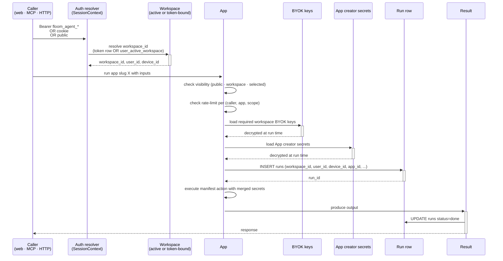
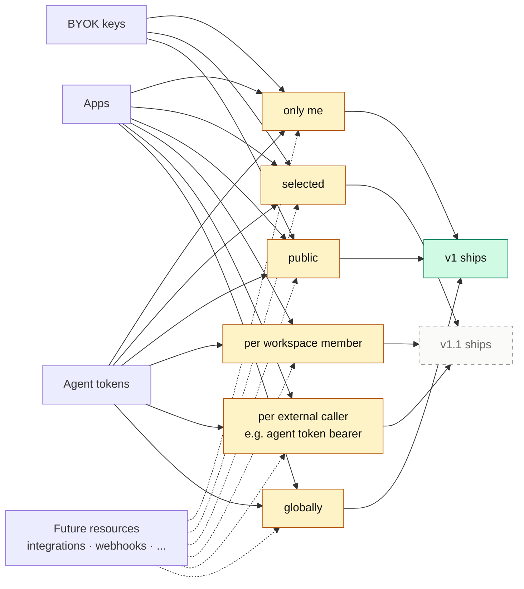
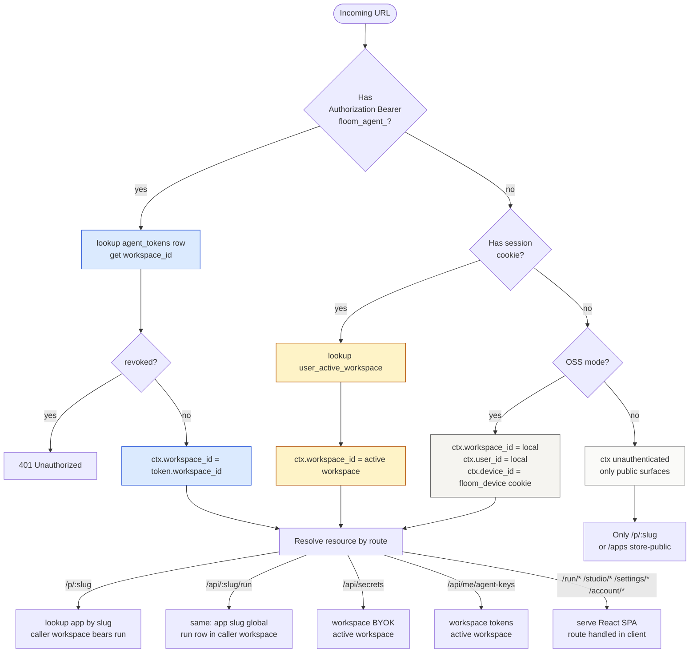
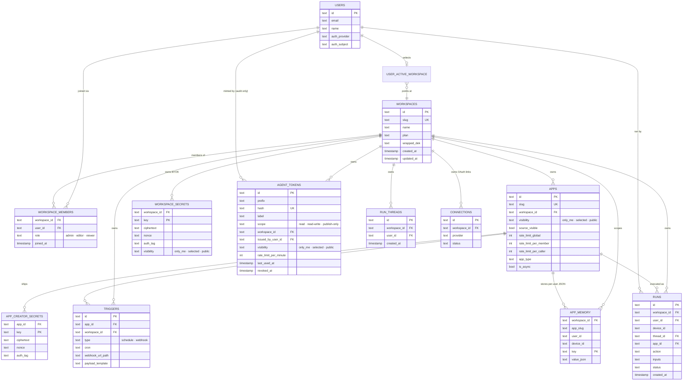

# Floom architecture — connection diagram

Date: 2026-04-27
Author: Claude
Source: synthesized from FLOOM-ARCHITECTURE-DECISIONS.md (21 ADRs) + current schema + V26-IA-SPEC.md

This doc shows how Floom's pieces connect. Three diagrams:

1. **Top-level architecture** — entities + how they relate
2. **Three-surface flow** — how a run reaches its target across web/MCP/HTTP
3. **Visibility + rate-limit model** — the foundational pattern Federico locked

---

## 1. Top-level architecture

```mermaid
graph TB
  classDef tenant fill:#d1fae5,stroke:#047857,stroke-width:2px,color:#0e0e0c
  classDef identity fill:#fef3c7,stroke:#b45309,stroke-width:1px,color:#0e0e0c
  classDef credential fill:#dbeafe,stroke:#1d4ed8,stroke-width:1px,color:#0e0e0c
  classDef app fill:#ffffff,stroke:#0e0e0c,stroke-width:1.5px,color:#0e0e0c
  classDef runtime fill:#f5f4f0,stroke:#666,stroke-width:1px,color:#0e0e0c
  classDef surface fill:#1b1a17,stroke:#1b1a17,stroke-width:1px,color:#e8e6e0
  classDef external fill:#fafaf8,stroke:#999,stroke-dasharray: 5 5,color:#666

  %% ========== IDENTITY LAYER ==========
  User[User<br/>global identity]:::identity
  Session[Session<br/>browser cookie]:::identity
  OAuth[OAuth providers<br/>Google · GitHub]:::external

  User -->|signs in via| OAuth
  OAuth -->|creates| Session
  Session -->|resolves| User

  %% ========== TENANT LAYER ==========
  Workspace[Workspace<br/>TENANT BOUNDARY]:::tenant
  WorkspaceMember[workspace_members<br/>user × workspace × role]:::tenant
  ActiveWorkspace[user_active_workspace<br/>which workspace is active]:::tenant

  User -->|joins via| WorkspaceMember
  WorkspaceMember -->|maps to| Workspace
  User -->|active selector| ActiveWorkspace
  ActiveWorkspace -->|points at| Workspace

  %% ========== CREDENTIAL LAYER (workspace-scoped) ==========
  BYOK[BYOK keys<br/>workspace_secrets<br/>provider creds at runtime]:::credential
  AgentTokens[Agent tokens<br/>floom_agent_*<br/>headless workspace credentials]:::credential
  CreatorSecrets[App creator secrets<br/>per-app publisher defaults]:::credential

  Workspace -->|owns| BYOK
  Workspace -->|owns| AgentTokens

  %% ========== APP LAYER ==========
  App[App<br/>apps.workspace_id<br/>+ visibility + source_visible<br/>+ rate_limit]:::app
  AppManifest[Manifest<br/>floom.yaml<br/>actions · inputs · required_byok_keys]:::app
  CreatorSecretsPolicy[creator_secret_policies<br/>per app · per key · default value]:::app

  Workspace -->|owns| App
  App -->|declares| AppManifest
  App -->|publisher provides| CreatorSecrets
  CreatorSecrets -.->|via| CreatorSecretsPolicy
  CreatorSecretsPolicy -.->|covers| App

  %% ========== RUNTIME LAYER ==========
  Run[Run<br/>runs.workspace_id<br/>+ user_id + device_id + thread_id]:::runtime
  RunThread[run_threads<br/>conversation context]:::runtime
  AppMemory[app_memory<br/>per-workspace · per-app · per-user]:::runtime
  Trigger[Triggers<br/>schedule · webhook<br/>per workspace · per app]:::runtime

  App -->|fires| Run
  Run -->|belongs to| Workspace
  Run -.->|reads| BYOK
  Run -.->|reads| CreatorSecrets
  Run -->|may use| AppMemory
  Trigger -->|invokes| App
  Run -.->|may belong to| RunThread

  %% ========== SURFACE LAYER (3 surfaces) ==========
  WebSurface[Web<br/>/p/:slug forms]:::surface
  MCPSurface[MCP<br/>/mcp · /mcp/app/:slug<br/>headless agents]:::surface
  HTTPSurface[HTTP<br/>/api/:slug/run<br/>curl · scripts]:::surface

  Session -.->|drives| WebSurface
  AgentTokens -.->|authorize| MCPSurface
  AgentTokens -.->|authorize| HTTPSurface
  Session -.->|alternative auth| HTTPSurface

  WebSurface -->|creates| Run
  MCPSurface -->|creates| Run
  HTTPSurface -->|creates| Run

  %% ========== UI MODE LAYER ==========
  RunMode[Run mode<br/>/run/* consumer surfaces]:::tenant
  StudioMode[Studio mode<br/>/studio/* creator surfaces]:::tenant
  Settings[/settings tabbed page<br/>BYOK · Agent tokens · Studio]:::tenant
  AppStore[App store /apps<br/>mode-agnostic · public + workspace]:::tenant

  Workspace -->|consumer view| RunMode
  Workspace -->|creator view| StudioMode
  Workspace -->|click name| Settings
  Workspace -->|browse| AppStore

  RunMode -->|run installed| App
  StudioMode -->|publish · manage| App
  AppStore -->|run · fork · install| App
```

### How to read this

- **Green** = tenant boundary (Workspace + everything that belongs to it)
- **Yellow** = identity (Users + sessions + OAuth)
- **Blue** = credentials (the 3 families: BYOK keys, Agent tokens, App creator secrets)
- **White** = apps + their manifests
- **Cream** = runtime (runs, triggers, memory)
- **Black** = the 3 surfaces (Web, MCP, HTTP)

Solid arrows = "owns" or "creates". Dashed arrows = "reads" or "depends on".

---

## 2. Three-surface flow — how a run actually fires



### Key invariants

- **Workspace resolves the same way regardless of surface**: bearer token wins, else cookie, else anonymous OSS local
- **Run row always carries `workspace_id` + `user_id` + `device_id`** (the MCP run insert bug from L5 R1 was fixing this)
- **BYOK keys load from the CALLER's workspace**, not the app owner's workspace (per L1 §4)
- **App creator secrets load from the app's owner workspace** (per app)
- **Rate limit + visibility are checked BEFORE secret loading** (no leaking through rate-limited or hidden apps)

---

## 3. Visibility + rate-limit model (foundational pattern)



### The locked rule

> Every resource type Floom adds (apps, credentials, future things) ships with
> 3-tier visibility (only me / selected / public) + rate-limit scopes
> (per member / per external caller / globally).
>
> v1 launches with: only me + public + global rate limit.
> v1.1 launches with: selected + per-member + per-caller rate limits.

Source: V26-IA-SPEC.md point 11. This was raised pre-v24, dropped in v25, re-raised 2026-04-27 (Federico's "what happened" question).

---

## 4. URL → resource resolution

How any incoming URL resolves to a workspace + resource:



---

## 5. Database — entity relationship (high-level)



### Schema notes

- `apps.visibility`, `workspace_secrets.visibility`, `agent_tokens.visibility` — these fields ENFORCE the 3-tier model. Without them, the UI is a lie.
- `apps.rate_limit_*` fields back the rate-limit controls.
- `agent_tokens.issued_by_user_id` is **audit metadata only**, not ownership. The token belongs to the workspace.
- `runs.thread_id` ties multi-turn conversations together (per L1 §3).

---

## 6. The DRY collapse — UI side

After v26 IA, the React component tree should look like:

```mermaid
graph TB
  classDef shell fill:#d1fae5,stroke:#047857
  classDef shared fill:#fef3c7,stroke:#b45309
  classDef page fill:#ffffff,stroke:#0e0e0c

  AppRoot[App.tsx]
  AuthGate[AuthGate]:::shell
  Layout[WorkspaceShell<br/>workspace identity + mode toggle + rail]:::shell

  AppRoot --> AuthGate
  AuthGate --> Layout

  %% Single rail with mode prop
  Layout --> WorkspaceRail[WorkspaceRail<br/>mode = run · studio]:::shared
  Layout --> TopBar[TopBar slim<br/>logo + Copy for Claude + New app + avatar]:::shared

  %% Pages slot in via outlet
  Layout --> RunApps[/run/apps]:::page
  Layout --> RunRuns[/run/runs]:::page
  Layout --> RunRunsDetail[/run/runs/:id]:::page
  Layout --> StudioApps[/studio/apps]:::page
  Layout --> StudioRuns[/studio/runs]:::page
  Layout --> StudioBuild[/studio/build]:::page
  Layout --> StudioApp[/studio/apps/:slug]:::page
  Layout --> Settings[/settings · /settings/:tab]:::page
  Layout --> Account[/account/settings]:::page

  %% StudioApp has tabs as children
  StudioApp --> StudioAppTabs[Overview · Runs · Secrets · Access · ...]
  StudioAppTabs --> SecretsTab[App creator secrets<br/>+ Workspace BYOK requirements<br/>SECTION-PER-RESPONSIBILITY]:::shared

  %% Settings page tabs
  Settings --> SettingsTabs[General · BYOK · Agent tokens · Studio]
```

Killed in v26 (vs v25):
- ❌ `RunRail` (separate component) → folded into `WorkspaceRail` with `mode="run"`
- ❌ `StudioRail` (separate component) → folded into `WorkspaceRail` with `mode="studio"`
- ❌ `SettingsRail` (separate component) → folded into `WorkspaceRail` with `mode="settings"` or `null`
- ❌ `MePage` (Run dashboard) → drops, /run redirects to /run/apps
- ❌ `StudioHomePage` (Studio dashboard) → drops, /studio redirects to /studio/apps

---

## Single source of truth references

This diagram is downstream of:

- `/root/floom/docs/FLOOM-ARCHITECTURE-DECISIONS.md` — 21 ADRs (the decisions)
- `/root/floom/docs/V26-IA-SPEC.md` — current IA spec
- `/root/floom/docs/ARCHITECTURE-WORKSPACE.md` — L1 backend contract
- `/root/floom/docs/ARCHITECTURE-LAYER-2.md` — L2 route matrix
- Live schema in `apps/server/src/db.ts`

If any of those drift, this diagram is wrong. Update them together.
