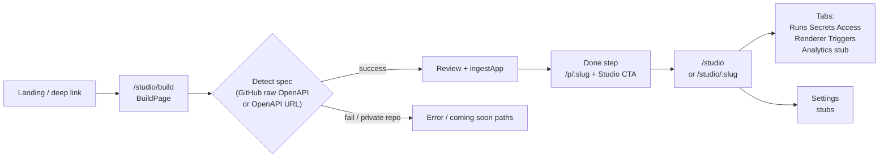

# pd-08: Creator lifecycle (publish → manage → iterate)

**Audit type:** Deep product truth — Studio `/studio/*` funnel vs promises in `docs/PRODUCT.md` and `docs/ROADMAP.md`  
**Primary code:** `apps/web/src/main.tsx` (routes), `StudioHomePage.tsx`, `StudioBuildPage.tsx`, `BuildPage.tsx`, `StudioAppPage.tsx`, `StudioTriggersTab.tsx`, `StudioAppRendererPage.tsx`, `StudioAppAnalyticsPage.tsx`, `StudioLayout.tsx`, `StudioSidebar.tsx`, `StudioSettingsPage.tsx`  
**Snapshot note:** Audit reflects repo state at authoring time; routes and copy may change.

---

## 1. Route map (`/studio/*`)

Defined in `apps/web/src/main.tsx` (lazy imports + `<Route>` tree).

| Route | Page component | Role in lifecycle |
|-------|----------------|-------------------|
| `/studio` | `StudioHomePage` | **Manage** — portfolio: owned apps, stats, delete, entry to build |
| `/studio/build` | `StudioBuildPage` → `BuildPage` | **Publish** — detect OpenAPI (GitHub raw paths or OpenAPI URL), review, `ingestApp` |
| `/studio/settings` | `StudioSettingsPage` | **Manage** — account link to `/me/settings`; API keys + billing **stubs** (“Coming v1.1”) |
| `/studio/:slug` | `StudioAppPage` | **Manage** — overview: visibility, primary action (multi-op apps), recent runs, danger zone |
| `/studio/:slug/runs` | `StudioAppRunsPage` | **Manage** — run list (not deep-read for this audit; routed) |
| `/studio/:slug/secrets` | `StudioAppSecretsPage` | **Manage** — secrets (routed) |
| `/studio/:slug/access` | `StudioAppAccessPage` | **Manage** — visibility + bearer / auth-required flows |
| `/studio/:slug/renderer` | `StudioAppRendererPage` | **Iterate** — `CustomRendererPanel` upload/test/delete |
| `/studio/:slug/analytics` | `StudioAppAnalyticsPage` | **Manage (future)** — **explicit stub** + mock chart, “Coming v1.1” |
| `/studio/:slug/triggers` | `StudioTriggersTab` | **Manage / automate** — schedules + webhooks, full UI |

**Redirects into Studio:** `/build`, `/deploy` → `/studio/build`; `/creator` → `/studio`; `/creator/:slug` → `/studio/:slug`; legacy `/me/apps/:slug*` → `/studio/...`.

**Out of Studio but in the lifecycle:** `/me/apps/:slug/run` remains **consumer run surface** (`MeAppRunPage`); Studio overview links to `/p/:slug` and `/me/runs/:id` for run rows — intentional split (`main.tsx` comments).

---

## 2. Funnel diagram (text + optional Mermaid)

**Intended mental model** (`PRODUCT.md`): paste repo → Floom hosts → three surfaces; **iterate** without becoming infra. **`ROADMAP.md`**: repo→hosted pipeline still partially unshipped; several UIs “re-enabled incrementally.”

**Publish:** `BuildPage` implements ramps (GitHub URL → candidate `raw.githubusercontent.com` OpenAPI paths; OpenAPI URL paste). **Docker** ramp opens a **Coming soon** modal (`ComingSoonRampModal`, `BuildPage.tsx`). **Iterate on an existing app** uses query `?edit=<slug>`: loads name/slug/description from `getApp` but user still must run detect and publish via `ingestApp` — not a dedicated “sync from live repo” or container rebuild (contrast `ROADMAP.md` P0 repo→hosted).

**Manage:** `StudioLayout` auth-gates cloud users (`StudioLayout.tsx`); `StudioHomePage` aggregates run samples for cards; `StudioAppPage` covers visibility, primary action, runs teaser, delete.

**Iterate:** Renderer tab = real upload path; Analytics = labeled stub; Triggers = productized automation (roadmap still lists related items under later tiers — implementation may run ahead of doc).

---

## 3. Executive truth table

| Promise / theme | Source | Observed in Studio / build UI | Status |
|-----------------|--------|------------------------------|--------|
| **Primary path: paste repo → Floom runs your code (hosting)** | `PRODUCT.md` deployment paths | **`/studio/build`** is OpenAPI **ingest** (detect + `ingestApp`), not `POST /api/deploy-github` / container run. GitHub ramp discovers **spec files** in public repos. | **Partial** (aligns with `ROADMAP.md` “still to land” for deploy route) |
| **OpenAPI = advanced path** | `PRODUCT.md` | Build flow **defaults** to GitHub + OpenAPI detection; creators may never see “advanced” framing. | **Partial** / positioning **Contradicted** vs doc ordering |
| **Three surfaces: `/p`, MCP, HTTP** | `PRODUCT.md` | Studio home empty state lists “Claude tool, page… CLI” (`StudioHomePage.tsx`); three surfaces not spelled as a checklist on Studio shell. “CLI” as creator-facing promise is weaker than documented HTTP/MCP surfaces unless clarified. | **Partial** |
| **Publish, manage, monitor** | `StudioHomePage` subhead | Home delivers publish + manage + real run aggregates; **monitor** is sparklines + stats, not full analytics (separate tab stub). | **Partial** |
| **Custom renderer upload** | `ROADMAP.md` “UI in flight” | **`StudioAppRendererPage`** mounts `CustomRendererPanel` — present as a first-class tab. | **Met** (UI exists; backend behavior out of scope here) |
| **Async job queue UI** | `ROADMAP.md` | Not part of the pages skimmed; lifecycle **manage** may omit long-running job UX. | **Missing** (roadmap-level) |
| **Workspace switcher, Composio** | `ROADMAP.md` | No routes under `/studio/*` for these; not surfaced in sidebar reviewed. | **Missing** (expected per roadmap) |
| **Analytics / observability** | `ROADMAP.md` P3 | **`StudioAppAnalyticsPage`** explicitly stub + “Coming v1.1” + pointer to Runs tab — honest. | **Missing** (by design) / **Met** (expectation management) |
| **Monetization / Billing** | `ROADMAP.md` | Sidebar **Billing (soon)**; `StudioSettingsPage` billing stub. | **Missing** / **Met** (labeled) |

**Legend:** **Met** = UI matches stated intent for creators. **Partial** = works with caveats. **Missing** = not delivered or only backend. **Contradicted** = two surfaces assert incompatible facts.

---

## 4. Dead ends, stubs, and copy risk

### Dead ends / narrow paths

- **`/studio/build` Docker tile:** Opens modal; no execution path (`BuildPage.tsx` “Docker import (coming soon)”).
- **`StudioSettingsPage` — Creator API keys & Billing:** Stub cards “Coming v1.1”; account work is delegated to `/me/settings` (`StudioSettingsPage.tsx`).
- **`StudioAppAnalyticsPage`:** Intentional stub (`StudioAppAnalyticsPage.tsx` file comment + “Coming v1.1” badge); not presented as live metrics.
- **Signed-out Studio preview:** `StudioHomePage` can show `StudioSignedOutState`; sidebar preview lists sub-nav items without **Triggers** in the decorative list (`StudioSidebar.tsx` `PreviewSection` vs real `SubNav` which includes Triggers) — minor preview mismatch.

### Stubs aligned with roadmap

- Billing, PAT/CLI in settings, Analytics tab — consistently deferred or labeled.

### Copy that over-promises or conflicts

| Issue | Where | Why it matters |
|-------|--------|----------------|
| **Delete semantics disagree** | `StudioHomePage.tsx` (delete modal: “Run **history remains**”) vs `StudioAppPage.tsx` (danger zone + modal: “**drops all run history**”) | Same user action (delete app) with **contradictory** retention claims — trust and support liability. |
| **“Ship your first app in 2 minutes” + “Claude tool… CLI…”** | `StudioHomePage.tsx` empty state | Energy sells; verify end-to-end time and **CLI** scope (install vs general CLI) match reality. |
| **“Paste your repo URL… live app”** | `BuildPage.tsx` GitHub ramp | Technically **OpenAPI-in-repo** discovery, not repo hosting-as-product (`PRODUCT.md` #1 path). |
| **“Private repos coming soon”** | `BuildPage.tsx` | Accurate limitation; sets expectation. |

---

## 5. ICP journey — creator lifecycle (with failure branches)

| Phase | Happy path | Failure / confusion branches |
|-------|------------|------------------------------|
| **Enter Studio** | Authenticated cloud user hits `/studio`, sees apps + stats | **Local preview user** (`is_local`): signed-out shell / login redirect (`StudioLayout.tsx`). **403/404** on app: bounced to `/p/:slug` or `/studio?notice=` (`StudioAppPage.tsx`). |
| **Publish** | `/studio/build` → detect → review → publish → done → “Manage in Studio” | **No OpenAPI in repo** → detect failure. **Private GitHub** → “coming soon” copy. **Anonymous** → signup prompt + `localStorage` resume. **Slug collision** → suggestions (`BuildPage.tsx`). |
| **Manage app** | Overview: visibility, links to Store/runs/secrets | **Visibility** duplicate mental model: overview + **Access** tab both exist — must stay consistent. **Recent runs** rows link to **`/me/runs/:id`** not `/studio/.../runs` — coherent if documented as “consumer run detail.” |
| **Iterate** | Re-ingest via build with `?edit=`; or Renderer; or Triggers | **`?edit=`** does not auto-pull new spec from GitHub — user must re-detect. **Analytics** promises future dashboards — OK if users read badge. |
| **Delete** | Confirm slug → API delete | **Copy conflict** on whether runs are retained (see above). |

---

## 6. Risk register

| ID | Tier | Risk | Evidence | Impact |
|----|------|------|----------|--------|
| R1 | **P0** | **Conflicting delete copy: run history “remains” vs “dropped”** | `StudioHomePage.tsx` (~line 367) vs `StudioAppPage.tsx` (~385, ~446) | Wrong user expectations; legal/support exposure |
| R2 | **P0** | **ICP expects repo hosting; Studio publish path is OpenAPI ingest** | `PRODUCT.md` vs `BuildPage.tsx` + `ROADMAP.md` P0 | Acquisition mismatch; churn after first deploy |
| R3 | **P1** | **“CLI” / three-surface story uneven in Studio empty state** | `StudioHomePage.tsx` empty state | Users hunt for product surfaces that are named differently elsewhere |
| R4 | **P1** | **Iterate loop weak without repo→hosted: `?edit=` is metadata + re-ingest** | `BuildPage.tsx` `editSlug` effect + `handlePublish` → `ingestApp` | Power users cannot “redeploy from branch” as promised in long-term vision |
| R5 | **P2** | **Sidebar “Billing (soon)” + settings stubs** | `StudioSidebar.tsx`, `StudioSettingsPage.tsx` | Acceptable if no paid upsell is implied pre-release |
| R6 | **P2** | **`StudioTriggersTab` productized while ROADMAP lists schedules/webhooks in later bucket** | `StudioTriggersTab.tsx` vs `ROADMAP.md` P3 | Docs drift; not user-harm if shipped |

---

## 7. PM questions (owner decisions)

1. **Which delete copy is canonical?** Should run rows (and/or analytics) persist after app deletion, or is cascade delete intended? Align `StudioHomePage` and `StudioAppPage` strings with backend behavior and privacy policy.
2. **What is the single-sentence “iterate” story for v1?** Re-ingest OpenAPI only vs upcoming **repo rebuild** — what should Studio highlight so ICPs do not expect Git push→auto-deploy before `POST /api/deploy-github` ships?
3. **Should Access and Overview both own visibility?** Two UIs (`StudioAppPage` vs `StudioAppAccessPage`) — is redundancy intentional ( progressive disclosure) or consolidation candidate?
4. **Triggers vs roadmap:** Should `ROADMAP.md` be updated to reflect shipped schedule/webhook UI, or is the backend considered experimental?
5. **Empty state “CLI”:** Does this mean `/me/install`, HTTP curl, or a future Floom CLI — which label matches shipping assets today?
6. **Analytics tab:** Keep in nav pre-1.0 (sets expectation) or hide until metrics exist to reduce nav noise?

---

## 8. Cross-references

- `docs/PRODUCT.md` — ICP, three surfaces, load-bearing paths (ingest, renderer pipeline, jobs).
- `docs/ROADMAP.md` — shipped vs UI pending, P0 repo-hosted gap, P3 analytics wording.
- Related deep audits: `pd-02-path1-repo-hosted-reality.md`, `pd-04-path3-openapi-as-default-risk.md`, `pd-17-renderer-differentiator.md`, `pd-12-monetization-deferred.md`.
